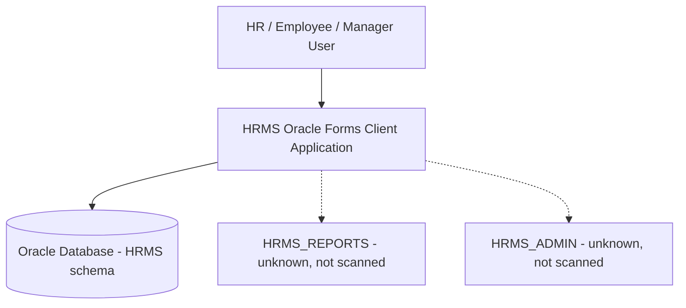
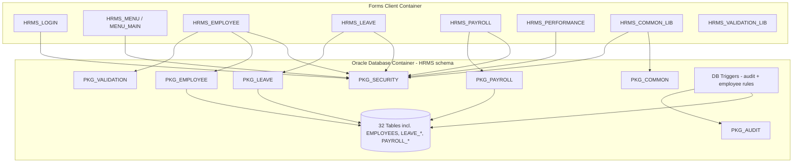
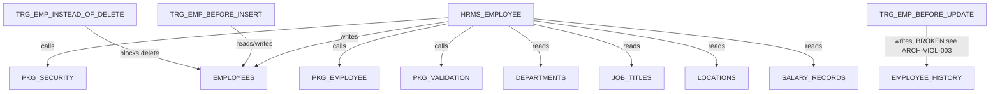
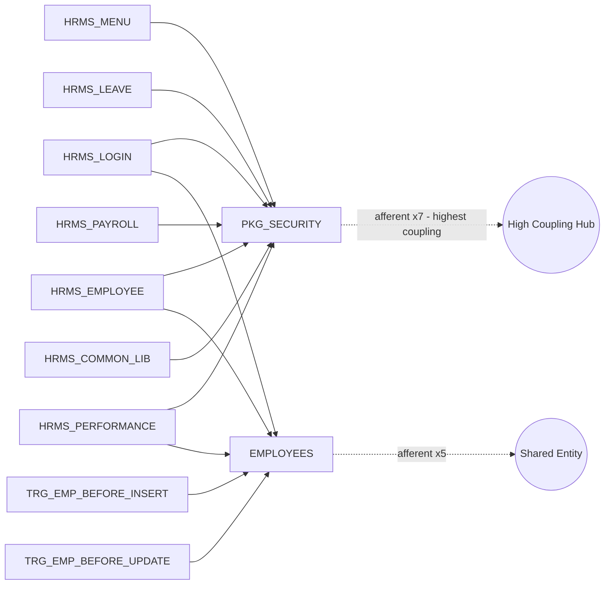
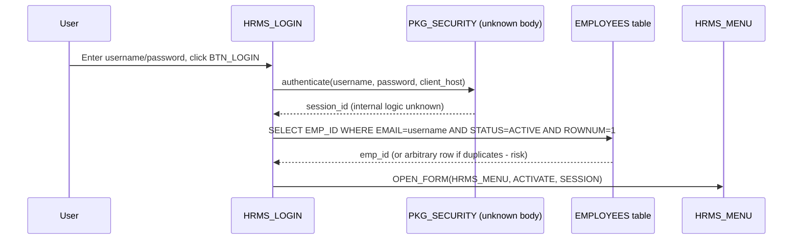

# Application Architecture Extraction — HRMS (ts-plsql-oracle-forms-hrms)

**Agent**: AA Agent 1 — Application Architecture Extractor
**Extraction date**: 2026-07-23
**Source root**: `source/ts-plsql-oracle-forms-hrms`
**Language**: PL/SQL (Oracle Forms + Oracle Database)
**Layer 1 status**: `source_code.json` reports 0 classes/methods/interfaces (PL/SQL is not class-based; Layer 1's OO extractor did not apply). Structural evidence for this report is therefore drawn from: `database.json` (32 tables, 20 package files, 6 triggers, 6 views), plus **deep-scanned raw source** for 2 Forms libraries, 1 menu module, 6 Forms XML exports, and 2 trigger DDL files. **10 package bodies/specs (20 files) were requested but returned `[Not found in deep scan]`** — their internal logic is `unknown` throughout this report; only call-site evidence (name + parameters used by callers) is available for them.

Per protocol, every `unknown` is recorded rather than inferred, and is repeated in `open-questions.md`-equivalent Section 14 below.

---

## 1. System Overview

HRMS is a **classic 2-tier/3-tier Oracle Forms client-server application** (v4.2, per about-box string `'HRMS v4.2 - Build 2024.03.15'` in `HRMS_MENU.xml`). There is no web tier, no REST/HTTP API, no microservice boundary, and no evidence of a modern application server beyond the Oracle Forms Services runtime implied by `.fmb`/`.mmb`/`.pll` artifacts. All presentation, control logic, and a large share of business/validation logic live inside Oracle Forms trigger code; the remainder lives in Oracle Database PL/SQL packages and triggers.

Confidence: 0.9 (directly evidenced by file types — `.fmb`/`.mmb`/`.pll` XML exports, `PKG_*` packages, and Oracle-specific builtins like `OPEN_FORM`, `COMMIT_FORM`, `GET_APPLICATION_PROPERTY`).

---

## 2. Applications / Projects Detected — `system-inventory.json`

```json
{
  "system_name": "HRMS - Human Resource Management System",
  "repo_root": "source/ts-plsql-oracle-forms-hrms",
  "applications": [
    {
      "name": "HRMS Oracle Forms Client Application",
      "type": "web_app",
      "framework": "Oracle Forms (client-server / Forms Services runtime, version unknown)",
      "deployable": true,
      "evidence": [
        { "file": "forms/xml-exports/HRMS_LOGIN.xml", "reason": "Form Module definition, OPEN_FORM chaining to HRMS_MENU" },
        { "file": "forms/menus/HRMS_MENU.mmb.sql", "reason": "Compiled Forms Menu Module (.mmb) source export" },
        { "file": "forms/libraries/HRMS_COMMON_LIB.pll.sql", "reason": "Compiled Forms PL/SQL Library (.pll) attached to all forms" }
      ],
      "confidence": 0.9
    },
    {
      "name": "HRMS Oracle Database (schema HRMS)",
      "type": "backend_api",
      "framework": "Oracle Database PL/SQL (packages/triggers/views) — not an HTTP API; closest taxonomy fit is 'backend service layer'",
      "deployable": true,
      "evidence": [
        { "file": "schema/tables/01_core_tables.sql", "reason": "DDL for core HRMS schema tables" },
        { "file": "plsql/packages/PKG_*.pks / .pkb (20 files)", "reason": "10 named packages, spec+body, forming the server-side business logic layer" },
        { "file": "plsql/triggers/trg_employees.sql, trg_audit.sql", "reason": "Row-level triggers enforcing DB-level business rules" }
      ],
      "confidence": 0.9
    }
  ],
  "supporting_projects": [
    {
      "name": "HRMS_COMMON_LIB.pll",
      "type": "library",
      "note": "Shared Forms library: toolbar handlers, error handling, date/session utilities. Attached to all forms."
    },
    {
      "name": "HRMS_VALIDATION_LIB.pll",
      "type": "library",
      "note": "Shared Forms library: client-side field validation (email/phone/SSN/date/salary). Attached to HRMS_EMPLOYEE only among files scanned."
    }
  ],
  "open_questions": [
    "Is there a web/API tier (e.g., Forms-to-web bridge, ESS/Self-Service portal) anywhere in the repo? Not found in files scanned — unknown.",
    "What Oracle Forms Services version / app server hosts the .fmb/.mmb/.pll artifacts? unknown — no config.json entries populated (config extraction returned 0 params).",
    "HRMS_REPORTS.xml and HRMS_ADMIN.xml (referenced by HRMS_MENU navigation) were not present in the deep scan — their structure is entirely unknown."
  ]
}
```

---

## 3. Deployable Units

| Unit | Evidence | Confidence |
|---|---|---|
| Oracle Forms client bundle (`.fmb` compiled forms + `.mmb` menu + `.pll` libraries) | `forms/xml-exports/*.xml`, `forms/menus/HRMS_MENU.mmb.sql`, `forms/libraries/*.pll.sql` | 0.9 |
| Oracle Database schema `HRMS` (tables, views, packages, triggers, sequences) | `database.json`, `schema/tables/*.sql`, `plsql/packages/*`, `plsql/triggers/*` | 0.9 |

No separate batch/worker/CLI deployable units were found. `unknown` whether any scheduled/batch jobs exist (e.g., leave accrual batch implied by `LEAVE_ACCRUAL_LOG` table and `RUN_ID` column, but no DBMS_SCHEDULER/job DDL was found in the scanned files).

---

## 4. Main Modules — `module-boundary-map.json`

```json
{
  "modules": [
    {
      "module_id": "MOD-001",
      "name": "Authentication & Security",
      "responsibility": "Login, session validation, permission checks, logout",
      "source_folders": ["forms/xml-exports/HRMS_LOGIN.xml"],
      "main_components": ["HRMS_LOGIN (form)", "PKG_SECURITY (package, body unknown)"],
      "entry_points": ["HRMS_LOGIN.BTN_LOGIN"],
      "depends_on_modules": ["MOD-002 (Employee — for EMP_ID lookup by email)"],
      "used_by_modules": ["MOD-002", "MOD-003", "MOD-004", "MOD-005", "MOD-006"],
      "afferent_coupling": 5,
      "efferent_coupling": 1,
      "boundary_quality": "Strong",
      "confidence": 0.85,
      "evidence": ["forms/xml-exports/HRMS_LOGIN.xml", "forms/xml-exports/HRMS_MENU.xml (has_permission gates)"],
      "open_questions": ["PKG_SECURITY internal implementation (authenticate, is_session_valid, has_permission, logout) is unknown — package body not found in deep scan."]
    },
    {
      "module_id": "MOD-002",
      "name": "Employee Management",
      "responsibility": "Core employee master data, dependents, emergency contacts, employment history",
      "source_folders": ["forms/xml-exports/HRMS_EMPLOYEE.xml", "plsql/triggers/trg_employees.sql"],
      "main_components": ["HRMS_EMPLOYEE (form)", "PKG_EMPLOYEE (unknown body)", "PKG_VALIDATION (unknown body)", "TRG_EMP_BEFORE_INSERT", "TRG_EMP_BEFORE_UPDATE", "TRG_EMP_INSTEAD_OF_DELETE"],
      "entry_points": ["HRMS_MENU.BTN_EMPLOYEES → OPEN_FORM('HRMS_EMPLOYEE')"],
      "depends_on_modules": ["MOD-001 (Security)", "MOD-007 (Org Reference Data — DEPARTMENTS/JOB_TITLES/LOCATIONS)"],
      "used_by_modules": ["MOD-003 (Payroll)", "MOD-004 (Leave)", "MOD-005 (Performance)", "MOD-009 (Audit)"],
      "afferent_coupling": 4,
      "efferent_coupling": 2,
      "boundary_quality": "Weak",
      "confidence": 0.85,
      "evidence": ["forms/xml-exports/HRMS_EMPLOYEE.xml", "plsql/triggers/trg_employees.sql"],
      "open_questions": [
        "TRG_EMP_BEFORE_UPDATE inserts into EMPLOYEE_HISTORY using columns that do not exist in the EMPLOYEE_HISTORY DDL — confirmed schema-mismatch defect (see ARCH-VIOL-003). This makes the module's audit-trail boundary unreliable.",
        "Business rule drift: hire-date future-limit is 90 days at Forms layer vs 180 days at DB trigger layer — module boundary is 'Weak' specifically because the same rule is inconsistently owned by two layers."
      ]
    },
    {
      "module_id": "MOD-003",
      "name": "Payroll",
      "responsibility": "Pay elements, pay periods, payroll run lifecycle (create/calculate/approve), tax, bank deposit",
      "source_folders": ["forms/xml-exports/HRMS_PAYROLL.xml"],
      "main_components": ["HRMS_PAYROLL (form)", "PKG_PAYROLL (unknown body)"],
      "entry_points": ["HRMS_MENU.BTN_PAYROLL / MI_PAYROLL → OPEN_FORM('HRMS_PAYROLL')"],
      "depends_on_modules": ["MOD-001 (Security — VIEW/APPROVE permission gates)", "MOD-002 (Employee)"],
      "used_by_modules": [],
      "afferent_coupling": 0,
      "efferent_coupling": 2,
      "boundary_quality": "Moderate",
      "confidence": 0.8,
      "evidence": ["forms/xml-exports/HRMS_PAYROLL.xml"],
      "open_questions": ["'Pay Details' tab page declared in canvas but PAYROLL_DETAIL/PAYSLIP_SUMMARY blocks not defined — module implementation is incomplete/stubbed in this form."]
    },
    {
      "module_id": "MOD-004",
      "name": "Leave Management",
      "responsibility": "Leave types, balances, requests (submit/cancel/approve), accrual log, holidays",
      "source_folders": ["forms/xml-exports/HRMS_LEAVE.xml"],
      "main_components": ["HRMS_LEAVE (form)", "PKG_LEAVE (unknown body)"],
      "entry_points": ["HRMS_MENU.BTN_LEAVE / MI_LEAVE → OPEN_FORM('HRMS_LEAVE')"],
      "depends_on_modules": ["MOD-001 (Security)", "MOD-002 (Employee — current user context)"],
      "used_by_modules": [],
      "afferent_coupling": 0,
      "efferent_coupling": 2,
      "boundary_quality": "Strong",
      "confidence": 0.85,
      "evidence": ["forms/xml-exports/HRMS_LEAVE.xml"],
      "open_questions": ["'Pending Approvals' and 'Team Calendar' tab pages declared but no backing blocks defined — stub/incomplete."]
    },
    {
      "module_id": "MOD-005",
      "name": "Performance Management",
      "responsibility": "Review cycles, performance reviews, goals",
      "source_folders": ["forms/xml-exports/HRMS_PERFORMANCE.xml"],
      "main_components": ["HRMS_PERFORMANCE (form)", "PKG_PERFORMANCE (unknown body, not observed as called by this form)"],
      "entry_points": ["HRMS_MENU.BTN_PERFORMANCE / MI_PERFORMANCE → OPEN_FORM('HRMS_PERFORMANCE')"],
      "depends_on_modules": ["MOD-001 (Security — session check only, no module-level permission gate)", "MOD-002 (Employee — display name lookup)"],
      "used_by_modules": [],
      "afferent_coupling": 0,
      "efferent_coupling": 2,
      "boundary_quality": "Weak",
      "confidence": 0.75,
      "evidence": ["forms/xml-exports/HRMS_PERFORMANCE.xml"],
      "open_questions": [
        "Form performs direct table CRUD (PERFORMANCE_REVIEW, PERFORMANCE_GOAL blocks with UpdateAllowed/InsertAllowed=Yes) with no visible call to PKG_PERFORMANCE — the package's role for this module is unknown/possibly unused by the UI.",
        "No PKG_SECURITY.has_permission gate for editing ratings/assessments, unlike Employee/Payroll — boundary is weak from an authorization standpoint."
      ]
    },
    {
      "module_id": "MOD-006",
      "name": "Navigation / Application Shell",
      "responsibility": "MDI parent form, main menu, module launch, coarse-grained authorization gating for menu visibility",
      "source_folders": ["forms/xml-exports/HRMS_MENU.xml", "forms/menus/HRMS_MENU.mmb.sql"],
      "main_components": ["HRMS_MENU (form)", "MENU_MAIN (menu module)"],
      "entry_points": ["Post-login OPEN_FORM('HRMS_MENU') from HRMS_LOGIN"],
      "depends_on_modules": ["MOD-001", "MOD-002", "MOD-003", "MOD-004", "MOD-005", "MOD-007 (Reports — unknown)", "MOD-008 (Admin — unknown)"],
      "used_by_modules": [],
      "afferent_coupling": 0,
      "efferent_coupling": 6,
      "boundary_quality": "Moderate",
      "confidence": 0.85,
      "evidence": ["forms/xml-exports/HRMS_MENU.xml"],
      "open_questions": ["Menu-bar CommandText paths for MI_PAYROLL/MI_REPORTS rely only on a disabled-state gate set at form-instance time, with no runtime has_permission recheck in the CommandText itself, unlike the button path (BTN_PAYROLL/BTN_REPORTS) which double-checks — inconsistent authorization depth between two entry paths to the same target forms."]
    },
    {
      "module_id": "MOD-007",
      "name": "Organization Reference Data",
      "responsibility": "Departments, locations, job grades/titles — shared lookup/reference data consumed via LOVs across modules",
      "source_folders": ["schema/tables/01_core_tables.sql"],
      "main_components": ["DEPARTMENTS", "LOCATIONS", "JOB_GRADES", "JOB_TITLES", "LOOKUP_VALUES"],
      "entry_points": ["unknown — no dedicated maintenance form found in deep scan"],
      "depends_on_modules": [],
      "used_by_modules": ["MOD-002", "MOD-003", "MOD-004"],
      "afferent_coupling": 3,
      "efferent_coupling": 0,
      "boundary_quality": "Unknown",
      "confidence": 0.5,
      "evidence": ["schema/tables/01_core_tables.sql (DEPARTMENTS, LOCATIONS, JOB_GRADES, JOB_TITLES DDL)", "forms/xml-exports/HRMS_EMPLOYEE.xml (LOV_DEPARTMENTS, LOV_JOB_TITLES, LOV_LOCATIONS)"],
      "open_questions": ["No admin/maintenance form for these reference tables was found — unknown whether one exists in HRMS_ADMIN.xml (not scanned) or whether these are maintained via direct SQL/another tool."]
    },
    {
      "module_id": "MOD-008",
      "name": "Reporting",
      "responsibility": "unknown — implied by PKG_REPORTING package and HRMS_REPORTS menu target",
      "source_folders": ["unknown"],
      "main_components": ["PKG_REPORTING (unknown body)"],
      "entry_points": ["HRMS_MENU.BTN_REPORTS / MI_REPORTS → OPEN_FORM('HRMS_REPORTS') — target form not found in deep scan"],
      "depends_on_modules": ["MOD-001 (Security — REPORTS/VIEW permission referenced in HRMS_MENU)"],
      "used_by_modules": [],
      "afferent_coupling": 0,
      "efferent_coupling": 1,
      "boundary_quality": "Unknown",
      "confidence": 0.3,
      "evidence": ["forms/xml-exports/HRMS_MENU.xml (MI_REPORTS, BTN_REPORTS references)"],
      "open_questions": ["HRMS_REPORTS.xml not present in deep scan — entire module structure, tables used, and PKG_REPORTING contents are unknown."]
    },
    {
      "module_id": "MOD-009",
      "name": "System Administration",
      "responsibility": "unknown — implied by SYSTEM_PARAMETERS table and HRMS_ADMIN menu target",
      "source_folders": ["unknown"],
      "main_components": ["SYSTEM_PARAMETERS (table)"],
      "entry_points": ["HRMS_MENU.MI_ADMIN → OPEN_FORM('HRMS_ADMIN') — target form not found in deep scan"],
      "depends_on_modules": ["MOD-001 (Security — ADMIN/VIEW permission referenced in HRMS_MENU)"],
      "used_by_modules": [],
      "afferent_coupling": 0,
      "efferent_coupling": 1,
      "boundary_quality": "Unknown",
      "confidence": 0.3,
      "evidence": ["forms/xml-exports/HRMS_MENU.xml (MI_ADMIN reference)", "schema/tables/04_performance_tables.sql (SYSTEM_PARAMETERS DDL)"],
      "open_questions": ["HRMS_ADMIN.xml not present in deep scan — unknown what it manages (users, permissions, system params, all three?)."]
    },
    {
      "module_id": "MOD-010",
      "name": "Audit & Compliance",
      "responsibility": "Generic change-audit logging for SALARY_RECORDS, LEAVE_REQUESTS (status), DEPARTMENTS",
      "source_folders": ["plsql/triggers/trg_audit.sql"],
      "main_components": ["TRG_SALARY_AUDIT", "TRG_LEAVE_REQUEST_AUDIT", "TRG_DEPARTMENT_AUDIT", "PKG_AUDIT (unknown body)", "AUDIT_LOG (table)"],
      "entry_points": ["Fires automatically on INSERT/UPDATE/DELETE of SALARY_RECORDS, DEPARTMENTS; UPDATE OF STATUS on LEAVE_REQUESTS"],
      "depends_on_modules": ["MOD-002", "MOD-003", "MOD-004"],
      "used_by_modules": [],
      "afferent_coupling": 0,
      "efferent_coupling": 3,
      "boundary_quality": "Moderate",
      "confidence": 0.85,
      "evidence": ["plsql/triggers/trg_audit.sql"],
      "open_questions": ["PKG_AUDIT.log_action is called with 4 args in one trigger and 6 args (with JSON old/new values) in others — must be an overloaded/default-parameter procedure; internal behavior for the 4-arg case (does it still write NULL old/new values, or skip them entirely?) is unknown since the package body was not found."]
    },
    {
      "module_id": "MOD-011",
      "name": "Notification",
      "responsibility": "unknown — implied by PKG_NOTIFICATION and NOTIFICATION_QUEUE table; no caller of PKG_NOTIFICATION observed in any deep-scanned file",
      "source_folders": ["unknown"],
      "main_components": ["PKG_NOTIFICATION (unknown body)", "NOTIFICATION_QUEUE (table)"],
      "entry_points": ["unknown"],
      "depends_on_modules": [],
      "used_by_modules": [],
      "afferent_coupling": 0,
      "efferent_coupling": 0,
      "boundary_quality": "Unknown",
      "confidence": 0.3,
      "evidence": ["schema/tables/04_performance_tables.sql (NOTIFICATION_QUEUE DDL)"],
      "open_questions": ["No form or trigger in the deep scan calls PKG_NOTIFICATION — is it invoked from package bodies not extracted (e.g., PKG_LEAVE approval notifying the requester)? unknown."]
    },
    {
      "module_id": "MOD-012",
      "name": "Integration",
      "responsibility": "unknown — implied only by package name PKG_INTEGRATION",
      "source_folders": ["unknown"],
      "main_components": ["PKG_INTEGRATION (unknown body)"],
      "entry_points": ["unknown"],
      "depends_on_modules": [],
      "used_by_modules": [],
      "afferent_coupling": 0,
      "efferent_coupling": 0,
      "boundary_quality": "Unknown",
      "confidence": 0.2,
      "evidence": ["plsql/packages/PKG_INTEGRATION.pks/.pkb (file names only, bodies not found in deep scan)"],
      "open_questions": ["Purpose entirely unknown — could integrate with payroll tax filing, benefits vendor, LDAP/SSO, or a general-ledger export. No evidence available."]
    },
    {
      "module_id": "MOD-013",
      "name": "Cross-Cutting: Common Utilities & Validation",
      "responsibility": "Shared error handling, toolbar behavior, formatting, session helpers (PKG_COMMON, HRMS_COMMON_LIB); duplicated field validation (PKG_VALIDATION, HRMS_VALIDATION_LIB)",
      "source_folders": ["forms/libraries/HRMS_COMMON_LIB.pll.sql", "forms/libraries/HRMS_VALIDATION_LIB.pll.sql"],
      "main_components": ["HRMS_COMMON_LIB (library)", "HRMS_VALIDATION_LIB (library)", "PKG_COMMON (unknown body)", "PKG_VALIDATION (unknown body)"],
      "entry_points": ["Attached to all forms via ATTACH_LIBRARY"],
      "depends_on_modules": [],
      "used_by_modules": ["MOD-001", "MOD-002", "MOD-003", "MOD-004", "MOD-005", "MOD-006"],
      "afferent_coupling": 6,
      "efferent_coupling": 0,
      "boundary_quality": "Weak",
      "confidence": 0.85,
      "evidence": ["forms/libraries/HRMS_COMMON_LIB.pll.sql", "forms/libraries/HRMS_VALIDATION_LIB.pll.sql"],
      "open_questions": ["Explicitly documented in-code as a source of validation-logic duplication/drift versus server-side PKG_VALIDATION — boundary is 'Weak' by the module's own internal documentation, not just external inference."]
    }
  ]
}
```

---

## 5. Layered Structure

Evidence-backed layering (Oracle Forms apps do not cleanly separate presentation/service/domain — logic is scattered):

| Layer | What lives here | Evidence |
|---|---|---|
| Presentation/UI | Forms canvases, windows, items, LOVs, alerts | All `forms/xml-exports/*.xml` |
| API / Control (Forms triggers) | `WHEN-BUTTON-PRESSED`, `WHEN-VALIDATE-ITEM`, `WHEN-NEW-FORM-INSTANCE`, `KEY-*` triggers — contains both control flow AND embedded business rules (e.g., hire-date 90-day check, leave-cancel status check) | Same XML files |
| Cross-cutting (Forms) | `HRMS_COMMON_LIB` (error handling, toolbar, session), `HRMS_VALIDATION_LIB` (client validation) | `forms/libraries/*.pll.sql` |
| Application Service (DB) | `PKG_SECURITY`, `PKG_EMPLOYEE`, `PKG_PAYROLL`, `PKG_LEAVE`, `PKG_PERFORMANCE`, `PKG_REPORTING` — bodies unknown, call signatures only | `plsql/packages/*` (names only) |
| Cross-cutting (DB) | `PKG_COMMON`, `PKG_VALIDATION`, `PKG_AUDIT`, `PKG_NOTIFICATION`, `PKG_INTEGRATION` — bodies unknown | `plsql/packages/*` (names only) |
| Domain / Data Access | Tables + `GENERATED ALWAYS AS` computed columns (e.g., `LEAVE_BALANCES.AVAILABLE`), Views (`VW_*`) | `schema/tables/*.sql`, `database.json.views` |
| Infrastructure (DB triggers) | `TRG_EMP_BEFORE_INSERT/UPDATE`, `TRG_EMP_INSTEAD_OF_DELETE`, `TRG_SALARY_AUDIT`, `TRG_LEAVE_REQUEST_AUDIT`, `TRG_DEPARTMENT_AUDIT` — re-enforce business rules independently of the Forms/API layer | `plsql/triggers/*.sql` |

**Key finding**: business rules are not owned by a single layer. The same rule (e.g., hire-date limits, email format) is implemented independently in Presentation/Control, Cross-cutting, and Infrastructure layers, with observed drift between at least two of them (Section 9).

---

## 6. Component Summary — `component-registry.json` (representative — not exhaustive for unknown package bodies)

```json
{
  "components": [
    {
      "component_id": "COMP-001",
      "name": "HRMS_LOGIN",
      "type": "FrontendComponent",
      "layer": "Presentation/UI",
      "module": "MOD-001",
      "file": "forms/xml-exports/HRMS_LOGIN.xml",
      "start_line": null, "end_line": null,
      "public_methods": ["BTN_LOGIN (WHEN-BUTTON-PRESSED)", "KEY-NEXT-ITEM"],
      "dependencies": ["PKG_SECURITY.authenticate", "EMPLOYEES table (SELECT)"],
      "called_by": [],
      "risk_flags": ["Cleartext password transport (documented)", "No lockout/2FA (documented)", "Catch-all WHEN OTHERS masks unrelated errors as auth failure"],
      "confidence": 0.9,
      "evidence": ["forms/xml-exports/HRMS_LOGIN.xml"]
    },
    {
      "component_id": "COMP-002",
      "name": "HRMS_MENU",
      "type": "FrontendComponent",
      "layer": "Presentation/UI",
      "module": "MOD-006",
      "file": "forms/xml-exports/HRMS_MENU.xml",
      "public_methods": ["BTN_EMPLOYEES", "BTN_PAYROLL", "BTN_LEAVE", "BTN_PERFORMANCE", "BTN_REPORTS", "BTN_LOGOUT"],
      "dependencies": ["PKG_SECURITY.has_permission", "PKG_SECURITY.logout", "OPEN_FORM(all module forms)"],
      "called_by": ["HRMS_LOGIN (via OPEN_FORM after auth)"],
      "risk_flags": ["Menu-bar command path lacks the runtime has_permission recheck that the button path has"],
      "confidence": 0.9,
      "evidence": ["forms/xml-exports/HRMS_MENU.xml"]
    },
    {
      "component_id": "COMP-003",
      "name": "HRMS_EMPLOYEE",
      "type": "FrontendComponent",
      "layer": "Presentation/UI",
      "module": "MOD-002",
      "file": "forms/xml-exports/HRMS_EMPLOYEE.xml",
      "public_methods": ["WHEN-NEW-FORM-INSTANCE", "ON-ERROR", "KEY-EXIT", "PRE-INSERT", "PRE-UPDATE", "POST-QUERY", "WHEN-VALIDATE-ITEM"],
      "dependencies": ["PKG_SECURITY.is_session_valid", "PKG_SECURITY.has_permission", "PKG_EMPLOYEE.generate_emp_number", "PKG_VALIDATION.validate_email_format", "SEQ_EMPLOYEE", "EMPLOYEES", "DEPARTMENTS", "JOB_TITLES", "JOB_GRADES", "LOCATIONS", "SALARY_RECORDS"],
      "called_by": ["HRMS_MENU.BTN_EMPLOYEES"],
      "risk_flags": ["Hire-date validation (90 days) diverges from DB trigger (180 days)", "KEY-EXIT may double-invoke SHOW_ALERT('ALT_CONFIRM_EXIT')"],
      "confidence": 0.9,
      "evidence": ["forms/xml-exports/HRMS_EMPLOYEE.xml"]
    },
    {
      "component_id": "COMP-004",
      "name": "HRMS_LEAVE",
      "type": "FrontendComponent",
      "layer": "Presentation/UI",
      "module": "MOD-004",
      "file": "forms/xml-exports/HRMS_LEAVE.xml",
      "public_methods": ["WHEN-NEW-FORM-INSTANCE", "BTN_CANCEL_REQUEST", "BTN_SUBMIT", "POST-QUERY"],
      "dependencies": ["PKG_SECURITY.is_session_valid", "PKG_LEAVE.cancel_leave_request", "PKG_LEAVE.submit_leave_request", "LEAVE_REQUESTS", "LEAVE_TYPES", "LEAVE_BALANCES"],
      "called_by": ["HRMS_MENU.BTN_LEAVE"],
      "risk_flags": ["Pending Approvals / Team Calendar tab pages stubbed — no backing blocks"],
      "confidence": 0.9,
      "evidence": ["forms/xml-exports/HRMS_LEAVE.xml"]
    },
    {
      "component_id": "COMP-005",
      "name": "HRMS_PAYROLL",
      "type": "FrontendComponent",
      "layer": "Presentation/UI",
      "module": "MOD-003",
      "file": "forms/xml-exports/HRMS_PAYROLL.xml",
      "public_methods": ["WHEN-NEW-FORM-INSTANCE", "BTN_CREATE_RUN", "BTN_CALCULATE", "BTN_APPROVE"],
      "dependencies": ["PKG_SECURITY.is_session_valid", "PKG_SECURITY.has_permission", "PKG_PAYROLL.create_payroll_run", "PKG_PAYROLL.calculate_payroll", "PKG_PAYROLL.approve_payroll", "PAY_PERIODS", "PAYROLL_RUNS"],
      "called_by": ["HRMS_MENU.BTN_PAYROLL"],
      "risk_flags": ["BTN_CREATE_RUN and BTN_CALCULATE have no explicit permission check beyond the form-level VIEW gate — only BTN_APPROVE checks PAYROLL/APPROVE", "'Pay Details' tab stubbed"],
      "confidence": 0.9,
      "evidence": ["forms/xml-exports/HRMS_PAYROLL.xml"]
    },
    {
      "component_id": "COMP-006",
      "name": "HRMS_PERFORMANCE",
      "type": "FrontendComponent",
      "layer": "Presentation/UI",
      "module": "MOD-005",
      "file": "forms/xml-exports/HRMS_PERFORMANCE.xml",
      "public_methods": ["WHEN-NEW-FORM-INSTANCE", "POST-QUERY"],
      "dependencies": ["PKG_SECURITY.is_session_valid", "REVIEW_CYCLES", "PERFORMANCE_REVIEWS", "PERFORMANCE_GOALS", "EMPLOYEES"],
      "called_by": ["HRMS_MENU.BTN_PERFORMANCE"],
      "risk_flags": ["No module/action-level permission gate for editing ratings/assessments", "Direct table DML with no observed service-package mediation", "'Review Detail' block stubbed"],
      "confidence": 0.85,
      "evidence": ["forms/xml-exports/HRMS_PERFORMANCE.xml"]
    },
    {
      "component_id": "COMP-007",
      "name": "HRMS_COMMON_LIB",
      "type": "FrontendService",
      "layer": "Cross-cutting",
      "module": "MOD-013",
      "file": "forms/libraries/HRMS_COMMON_LIB.pll.sql",
      "public_methods": ["handle_error", "toolbar_save/clear/query/first/prev/next/last/insert/delete/exit", "format_date", "format_datetime", "get_current_user", "get_session_id", "check_session", "refresh_lov"],
      "dependencies": ["PKG_COMMON.log_error", "PKG_SECURITY.is_session_valid"],
      "called_by": ["All forms (attached library)"],
      "risk_flags": ["toolbar_delete calls DELETE_RECORD directly — will always fail on EMPLOYEES due to TRG_EMP_INSTEAD_OF_DELETE (-20504) with no compensating ACTIVE_FLAG logic in the shared handler"],
      "confidence": 0.9,
      "evidence": ["forms/libraries/HRMS_COMMON_LIB.pll.sql"]
    },
    {
      "component_id": "COMP-008",
      "name": "HRMS_VALIDATION_LIB",
      "type": "Validator",
      "layer": "Cross-cutting",
      "module": "MOD-013",
      "file": "forms/libraries/HRMS_VALIDATION_LIB.pll.sql",
      "public_methods": ["validate_email", "validate_phone", "validate_ssn", "validate_date_not_future", "validate_salary_range"],
      "dependencies": ["JOB_GRADES table (direct query in validate_salary_range, despite header comment claiming a cache)"],
      "called_by": ["unknown — no form in the deep scan is observed calling this library's functions directly (HRMS_EMPLOYEE calls PKG_VALIDATION.validate_email_format server-side instead)"],
      "risk_flags": ["Documented validation-drift risk vs PKG_VALIDATION.validate_email_format", "Comment/code mismatch in validate_salary_range (claims cache, executes live query)"],
      "confidence": 0.85,
      "evidence": ["forms/libraries/HRMS_VALIDATION_LIB.pll.sql"]
    },
    {
      "component_id": "COMP-009",
      "name": "TRG_EMP_BEFORE_INSERT",
      "type": "Handler",
      "layer": "Infrastructure",
      "module": "MOD-002",
      "file": "plsql/triggers/trg_employees.sql",
      "public_methods": ["(trigger body)"],
      "dependencies": ["EMPLOYEES table"],
      "called_by": ["Oracle DB — fires BEFORE INSERT ON EMPLOYEES"],
      "risk_flags": ["180-day hire-date rule conflicts with Forms 90-day rule (ARCH-VIOL-001)", "Email uniqueness enforced only here, scoped to ACTIVE_FLAG='Y' — no backing unique constraint exists in DDL"],
      "confidence": 0.9,
      "evidence": ["plsql/triggers/trg_employees.sql"]
    },
    {
      "component_id": "COMP-010",
      "name": "TRG_EMP_BEFORE_UPDATE",
      "type": "Handler",
      "layer": "Infrastructure",
      "module": "MOD-002",
      "file": "plsql/triggers/trg_employees.sql",
      "public_methods": ["(trigger body)"],
      "dependencies": ["EMPLOYEES table", "EMPLOYEE_HISTORY table", "SEQ_EMP_HISTORY"],
      "called_by": ["Oracle DB — fires BEFORE UPDATE ON EMPLOYEES"],
      "risk_flags": ["CRITICAL: inserts into EMPLOYEE_HISTORY using column names (HISTORY_ID, CHANGE_DATE, OLD_VALUE, NEW_VALUE, CHANGED_BY) absent from the actual DDL, and CHANGE_TYPE values ('DEPARTMENT_CHANGE','JOB_CHANGE') not permitted by CHK_CHANGE_TYPE — this code path will raise an Oracle error at runtime on any department/job/status change update"],
      "confidence": 0.9,
      "evidence": ["plsql/triggers/trg_employees.sql", "schema/tables/01_core_tables.sql (EMPLOYEE_HISTORY DDL + CHK_CHANGE_TYPE)"]
    },
    {
      "component_id": "COMP-011",
      "name": "TRG_EMP_INSTEAD_OF_DELETE",
      "type": "Handler",
      "layer": "Infrastructure",
      "module": "MOD-002",
      "file": "plsql/triggers/trg_employees.sql",
      "public_methods": ["(trigger body)"],
      "dependencies": ["EMPLOYEES table"],
      "called_by": ["Oracle DB — fires BEFORE DELETE ON EMPLOYEES"],
      "risk_flags": ["Unconditionally blocks all physical deletes (-20504); no compensating logic exists in the Forms toolbar_delete handler it depends on for correct UX"],
      "confidence": 0.9,
      "evidence": ["plsql/triggers/trg_employees.sql"]
    },
    {
      "component_id": "COMP-012",
      "name": "PKG_SECURITY",
      "type": "Service",
      "layer": "Application Service",
      "module": "MOD-001",
      "file": "plsql/packages/PKG_SECURITY.pks / .pkb",
      "public_methods": ["authenticate (inferred signature: username, password, client_host → session_id)", "is_session_valid (session_id → boolean)", "has_permission (emp_id, module, action → boolean)", "logout (session_id)"],
      "dependencies": ["unknown (body not extracted) — likely USER_SESSIONS table given its columns"],
      "called_by": ["HRMS_LOGIN", "HRMS_MENU", "HRMS_EMPLOYEE", "HRMS_LEAVE", "HRMS_PAYROLL", "HRMS_PERFORMANCE", "HRMS_COMMON_LIB.check_session"],
      "risk_flags": ["Highest afferent coupling in the system — every form and the shared library depend on it"],
      "confidence": 0.6,
      "evidence": ["Call sites in all 6 forms + HRMS_COMMON_LIB.pll.sql; package body itself unknown"]
    }
  ]
}
```

**Package components with body unknown (call-signature evidence only)**: `PKG_EMPLOYEE.generate_emp_number`, `PKG_VALIDATION.validate_email_format`, `PKG_LEAVE.submit_leave_request`/`cancel_leave_request`, `PKG_PAYROLL.create_payroll_run`/`calculate_payroll`/`approve_payroll`, `PKG_COMMON.log_error`, `PKG_AUDIT.log_action`. **Package components with zero observed call sites anywhere in the deep scan** (existence known only from `database.json` package list): `PKG_PERFORMANCE`, `PKG_REPORTING`, `PKG_NOTIFICATION`, `PKG_INTEGRATION`.

---

## 7. Interfaces / Entry Points — `application-interface-catalogue.json`

No HTTP/REST/GraphQL/webhook interfaces exist in this system. The closest taxonomy fit for an Oracle Forms screen is `FrontendRoute`; this is noted as a taxonomy mismatch rather than invented infrastructure.

```json
{
  "interfaces": [
    {
      "interface_id": "INT-001",
      "type": "FrontendRoute",
      "method": "unknown",
      "path_or_name": "HRMS_LOGIN (Forms module, application entry point)",
      "owner_module": "MOD-001",
      "entry_component": "HRMS_LOGIN.BTN_LOGIN",
      "called_service": "PKG_SECURITY.authenticate",
      "visibility": "external",
      "evidence": ["forms/xml-exports/HRMS_LOGIN.xml"],
      "confidence": 0.9,
      "open_questions": []
    },
    {
      "interface_id": "INT-002",
      "type": "FrontendRoute",
      "method": "unknown",
      "path_or_name": "HRMS_MENU (post-login application shell)",
      "owner_module": "MOD-006",
      "entry_component": "OPEN_FORM('HRMS_MENU') from HRMS_LOGIN",
      "called_service": "PKG_SECURITY.has_permission (menu gating)",
      "visibility": "user_facing",
      "evidence": ["forms/xml-exports/HRMS_MENU.xml"],
      "confidence": 0.9,
      "open_questions": []
    },
    {
      "interface_id": "INT-003",
      "type": "FrontendRoute",
      "method": "unknown",
      "path_or_name": "HRMS_EMPLOYEE",
      "owner_module": "MOD-002",
      "entry_component": "HRMS_MENU.BTN_EMPLOYEES",
      "called_service": "PKG_EMPLOYEE, PKG_VALIDATION",
      "visibility": "user_facing",
      "evidence": ["forms/xml-exports/HRMS_EMPLOYEE.xml"],
      "confidence": 0.9,
      "open_questions": []
    },
    {
      "interface_id": "INT-004",
      "type": "FrontendRoute",
      "method": "unknown",
      "path_or_name": "HRMS_LEAVE",
      "owner_module": "MOD-004",
      "entry_component": "HRMS_MENU.BTN_LEAVE",
      "called_service": "PKG_LEAVE",
      "visibility": "user_facing",
      "evidence": ["forms/xml-exports/HRMS_LEAVE.xml"],
      "confidence": 0.9,
      "open_questions": []
    },
    {
      "interface_id": "INT-005",
      "type": "FrontendRoute",
      "method": "unknown",
      "path_or_name": "HRMS_PAYROLL",
      "owner_module": "MOD-003",
      "entry_component": "HRMS_MENU.BTN_PAYROLL",
      "called_service": "PKG_PAYROLL",
      "visibility": "admin",
      "evidence": ["forms/xml-exports/HRMS_PAYROLL.xml"],
      "confidence": 0.9,
      "open_questions": []
    },
    {
      "interface_id": "INT-006",
      "type": "FrontendRoute",
      "method": "unknown",
      "path_or_name": "HRMS_PERFORMANCE",
      "owner_module": "MOD-005",
      "entry_component": "HRMS_MENU.BTN_PERFORMANCE",
      "called_service": "unknown (no package call observed)",
      "visibility": "user_facing",
      "evidence": ["forms/xml-exports/HRMS_PERFORMANCE.xml"],
      "confidence": 0.85,
      "open_questions": []
    },
    {
      "interface_id": "INT-007",
      "type": "FrontendRoute",
      "method": "unknown",
      "path_or_name": "HRMS_REPORTS",
      "owner_module": "MOD-008",
      "entry_component": "HRMS_MENU.BTN_REPORTS / MI_REPORTS",
      "called_service": "PKG_REPORTING (inferred)",
      "visibility": "unknown",
      "evidence": ["forms/xml-exports/HRMS_MENU.xml (reference only)"],
      "confidence": 0.3,
      "open_questions": ["Target form HRMS_REPORTS.xml not found in deep scan."]
    },
    {
      "interface_id": "INT-008",
      "type": "FrontendRoute",
      "method": "unknown",
      "path_or_name": "HRMS_ADMIN",
      "owner_module": "MOD-009",
      "entry_component": "HRMS_MENU.MI_ADMIN",
      "called_service": "unknown",
      "visibility": "admin",
      "evidence": ["forms/xml-exports/HRMS_MENU.xml (reference only)"],
      "confidence": 0.3,
      "open_questions": ["Target form HRMS_ADMIN.xml not found in deep scan."]
    },
    {
      "interface_id": "INT-009",
      "type": "Unknown",
      "method": "unknown",
      "path_or_name": "Leave accrual batch process (inferred)",
      "owner_module": "MOD-004",
      "entry_component": "unknown",
      "called_service": "unknown — LEAVE_ACCRUAL_LOG.RUN_ID column implies a batch RUN concept similar to PAYROLL_RUNS",
      "visibility": "internal",
      "evidence": ["schema/tables/03_leave_tables.sql (LEAVE_ACCRUAL_LOG.RUN_ID column)"],
      "confidence": 0.3,
      "open_questions": ["No scheduled job / DBMS_SCHEDULER DDL or PKG_LEAVE body was found to confirm this is an actual batch job vs. manual trigger."]
    }
  ]
}
```

---

## 8. Dependency Summary — `dependency-graph.json`

```json
{
  "nodes": [
    { "id": "HRMS_LOGIN", "type": "component", "module": "MOD-001", "layer": "Presentation/UI" },
    { "id": "HRMS_MENU", "type": "component", "module": "MOD-006", "layer": "Presentation/UI" },
    { "id": "HRMS_EMPLOYEE", "type": "component", "module": "MOD-002", "layer": "Presentation/UI" },
    { "id": "HRMS_LEAVE", "type": "component", "module": "MOD-004", "layer": "Presentation/UI" },
    { "id": "HRMS_PAYROLL", "type": "component", "module": "MOD-003", "layer": "Presentation/UI" },
    { "id": "HRMS_PERFORMANCE", "type": "component", "module": "MOD-005", "layer": "Presentation/UI" },
    { "id": "HRMS_COMMON_LIB", "type": "component", "module": "MOD-013", "layer": "Cross-cutting" },
    { "id": "HRMS_VALIDATION_LIB", "type": "component", "module": "MOD-013", "layer": "Cross-cutting" },
    { "id": "PKG_SECURITY", "type": "component", "module": "MOD-001", "layer": "Application Service" },
    { "id": "PKG_EMPLOYEE", "type": "component", "module": "MOD-002", "layer": "Application Service" },
    { "id": "PKG_VALIDATION", "type": "component", "module": "MOD-013", "layer": "Cross-cutting" },
    { "id": "PKG_LEAVE", "type": "component", "module": "MOD-004", "layer": "Application Service" },
    { "id": "PKG_PAYROLL", "type": "component", "module": "MOD-003", "layer": "Application Service" },
    { "id": "PKG_COMMON", "type": "component", "module": "MOD-013", "layer": "Cross-cutting" },
    { "id": "PKG_AUDIT", "type": "component", "module": "MOD-010", "layer": "Cross-cutting" },
    { "id": "EMPLOYEES", "type": "component", "module": "MOD-002", "layer": "Data Access" },
    { "id": "EMPLOYEE_HISTORY", "type": "component", "module": "MOD-002", "layer": "Data Access" },
    { "id": "DEPARTMENTS", "type": "component", "module": "MOD-007", "layer": "Data Access" },
    { "id": "JOB_TITLES", "type": "component", "module": "MOD-007", "layer": "Data Access" },
    { "id": "JOB_GRADES", "type": "component", "module": "MOD-007", "layer": "Data Access" },
    { "id": "LOCATIONS", "type": "component", "module": "MOD-007", "layer": "Data Access" },
    { "id": "SALARY_RECORDS", "type": "component", "module": "MOD-003", "layer": "Data Access" },
    { "id": "LEAVE_REQUESTS", "type": "component", "module": "MOD-004", "layer": "Data Access" },
    { "id": "LEAVE_TYPES", "type": "component", "module": "MOD-004", "layer": "Data Access" },
    { "id": "LEAVE_BALANCES", "type": "component", "module": "MOD-004", "layer": "Data Access" },
    { "id": "PAY_PERIODS", "type": "component", "module": "MOD-003", "layer": "Data Access" },
    { "id": "PAYROLL_RUNS", "type": "component", "module": "MOD-003", "layer": "Data Access" },
    { "id": "TRG_EMP_BEFORE_INSERT", "type": "component", "module": "MOD-002", "layer": "Infrastructure" },
    { "id": "TRG_EMP_BEFORE_UPDATE", "type": "component", "module": "MOD-002", "layer": "Infrastructure" },
    { "id": "TRG_EMP_INSTEAD_OF_DELETE", "type": "component", "module": "MOD-002", "layer": "Infrastructure" },
    { "id": "TRG_SALARY_AUDIT", "type": "component", "module": "MOD-010", "layer": "Infrastructure" },
    { "id": "TRG_LEAVE_REQUEST_AUDIT", "type": "component", "module": "MOD-010", "layer": "Infrastructure" },
    { "id": "TRG_DEPARTMENT_AUDIT", "type": "component", "module": "MOD-010", "layer": "Infrastructure" }
  ],
  "edges": [
    { "from": "HRMS_LOGIN", "to": "PKG_SECURITY", "relationship": "calls", "evidence": ["forms/xml-exports/HRMS_LOGIN.xml: PKG_SECURITY.authenticate"] },
    { "from": "HRMS_LOGIN", "to": "EMPLOYEES", "relationship": "reads", "evidence": ["SELECT EMP_ID ... FROM EMPLOYEES WHERE UPPER(EMAIL)=UPPER(:LOGIN.USERNAME)"] },
    { "from": "HRMS_LOGIN", "to": "HRMS_MENU", "relationship": "calls", "evidence": ["OPEN_FORM('HRMS_MENU', ACTIVATE, SESSION)"] },
    { "from": "HRMS_MENU", "to": "PKG_SECURITY", "relationship": "calls", "evidence": ["has_permission, logout calls in HRMS_MENU.xml"] },
    { "from": "HRMS_MENU", "to": "HRMS_EMPLOYEE", "relationship": "calls", "evidence": ["OPEN_FORM('HRMS_EMPLOYEE', ...)"] },
    { "from": "HRMS_MENU", "to": "HRMS_PAYROLL", "relationship": "calls", "evidence": ["OPEN_FORM('HRMS_PAYROLL', ...)"] },
    { "from": "HRMS_MENU", "to": "HRMS_LEAVE", "relationship": "calls", "evidence": ["OPEN_FORM('HRMS_LEAVE', ...)"] },
    { "from": "HRMS_MENU", "to": "HRMS_PERFORMANCE", "relationship": "calls", "evidence": ["OPEN_FORM('HRMS_PERFORMANCE', ...)"] },
    { "from": "HRMS_EMPLOYEE", "to": "PKG_SECURITY", "relationship": "calls", "evidence": ["is_session_valid, has_permission"] },
    { "from": "HRMS_EMPLOYEE", "to": "PKG_EMPLOYEE", "relationship": "calls", "evidence": ["generate_emp_number in PRE-INSERT"] },
    { "from": "HRMS_EMPLOYEE", "to": "PKG_VALIDATION", "relationship": "calls", "evidence": ["validate_email_format in WHEN-VALIDATE-ITEM"] },
    { "from": "HRMS_EMPLOYEE", "to": "EMPLOYEES", "relationship": "writes", "evidence": ["block DML target HRMS.EMPLOYEES"] },
    { "from": "HRMS_EMPLOYEE", "to": "DEPARTMENTS", "relationship": "reads", "evidence": ["DEPT_NAME_DISP lookup, LOV_DEPARTMENTS"] },
    { "from": "HRMS_EMPLOYEE", "to": "JOB_TITLES", "relationship": "reads", "evidence": ["JOB_TITLE_DISP lookup, LOV_JOB_TITLES"] },
    { "from": "HRMS_EMPLOYEE", "to": "LOCATIONS", "relationship": "reads", "evidence": ["LOV_LOCATIONS"] },
    { "from": "HRMS_EMPLOYEE", "to": "SALARY_RECORDS", "relationship": "reads", "evidence": ["SALARY detail block, EMP_SALARY_REL"] },
    { "from": "TRG_EMP_BEFORE_INSERT", "to": "EMPLOYEES", "relationship": "reads", "evidence": ["email uniqueness SELECT COUNT(*) FROM EMPLOYEES"] },
    { "from": "TRG_EMP_BEFORE_UPDATE", "to": "EMPLOYEE_HISTORY", "relationship": "writes", "evidence": ["INSERT INTO EMPLOYEE_HISTORY (mismatched columns — see ARCH-VIOL-003)"] },
    { "from": "HRMS_LEAVE", "to": "PKG_SECURITY", "relationship": "calls", "evidence": ["is_session_valid"] },
    { "from": "HRMS_LEAVE", "to": "PKG_LEAVE", "relationship": "calls", "evidence": ["submit_leave_request, cancel_leave_request"] },
    { "from": "HRMS_LEAVE", "to": "LEAVE_REQUESTS", "relationship": "reads", "evidence": ["LEAVE_REQUEST block query"] },
    { "from": "HRMS_LEAVE", "to": "LEAVE_TYPES", "relationship": "reads", "evidence": ["LOV_LEAVE_TYPES, POST-QUERY lookup"] },
    { "from": "HRMS_LEAVE", "to": "LEAVE_BALANCES", "relationship": "reads", "evidence": ["LEAVE_BALANCE block query"] },
    { "from": "TRG_LEAVE_REQUEST_AUDIT", "to": "PKG_AUDIT", "relationship": "calls", "evidence": ["log_action call in trg_audit.sql"] },
    { "from": "HRMS_PAYROLL", "to": "PKG_SECURITY", "relationship": "calls", "evidence": ["is_session_valid, has_permission (VIEW, APPROVE)"] },
    { "from": "HRMS_PAYROLL", "to": "PKG_PAYROLL", "relationship": "calls", "evidence": ["create_payroll_run, calculate_payroll, approve_payroll"] },
    { "from": "HRMS_PAYROLL", "to": "PAY_PERIODS", "relationship": "reads", "evidence": ["PAY_PERIOD block"] },
    { "from": "HRMS_PAYROLL", "to": "PAYROLL_RUNS", "relationship": "reads", "evidence": ["PAYROLL_RUN block"] },
    { "from": "TRG_SALARY_AUDIT", "to": "PKG_AUDIT", "relationship": "calls", "evidence": ["log_action call in trg_audit.sql"] },
    { "from": "TRG_DEPARTMENT_AUDIT", "to": "PKG_AUDIT", "relationship": "calls", "evidence": ["log_action call (4-arg variant) in trg_audit.sql"] },
    { "from": "HRMS_PERFORMANCE", "to": "PKG_SECURITY", "relationship": "calls", "evidence": ["is_session_valid only"] },
    { "from": "HRMS_PERFORMANCE", "to": "EMPLOYEES", "relationship": "reads", "evidence": ["EMP_NAME_DISP lookup"] },
    { "from": "HRMS_COMMON_LIB", "to": "PKG_COMMON", "relationship": "calls", "evidence": ["handle_error → PKG_COMMON.log_error"] },
    { "from": "HRMS_COMMON_LIB", "to": "PKG_SECURITY", "relationship": "calls", "evidence": ["check_session → PKG_SECURITY.is_session_valid"] },
    { "from": "HRMS_VALIDATION_LIB", "to": "JOB_GRADES", "relationship": "reads", "evidence": ["validate_salary_range direct query"] }
  ],
  "cycles": [],
  "high_coupling_components": [
    { "id": "PKG_SECURITY", "afferent": 7, "note": "Called by all 6 forms plus HRMS_COMMON_LIB — highest afferent coupling in the system" },
    { "id": "EMPLOYEES", "afferent": 5, "note": "Read/written by Login, Employee, Payroll(indirect via SALARY_RECORDS FK), Performance, and referenced by Audit/History triggers" }
  ],
  "high_coupling_modules": [
    { "id": "MOD-001 (Security)", "afferent": 5 },
    { "id": "MOD-002 (Employee)", "afferent": 4 },
    { "id": "MOD-013 (Common/Validation)", "afferent": 6 }
  ]
}
```

No true dependency **cycles** were found in the evidence gathered (Forms → Package → Table is consistently one-directional; the DB triggers are the only "reverse" path, from table mutation back into `PKG_AUDIT`, which does not cycle back to Forms).

---

## 9. Key Call Flows — `call-flow-map.json`

```json
{
  "flows": [
    {
      "flow_id": "FLOW-001",
      "name": "User Login",
      "entry_point": "HRMS_LOGIN.BTN_LOGIN (WHEN-BUTTON-PRESSED)",
      "steps": [
        { "step": 1, "component": "HRMS_LOGIN", "layer": "Presentation/UI", "module": "MOD-001", "operation": "Validate username/password not null" },
        { "step": 2, "component": "PKG_SECURITY", "layer": "Application Service", "module": "MOD-001", "operation": "authenticate(username, password, client_host) → session_id (internal logic unknown)" },
        { "step": 3, "component": "EMPLOYEES", "layer": "Data Access", "module": "MOD-002", "operation": "SELECT EMP_ID WHERE UPPER(EMAIL)=UPPER(username) AND EMPLOYMENT_STATUS='ACTIVE' AND ROWNUM=1" },
        { "step": 4, "component": "HRMS_MENU", "layer": "Presentation/UI", "module": "MOD-006", "operation": "OPEN_FORM('HRMS_MENU', ACTIVATE, SESSION)" }
      ],
      "modules_touched": ["MOD-001", "MOD-002", "MOD-006"],
      "external_systems_touched": [],
      "data_access_components": ["EMPLOYEES"],
      "risk_flags": ["WHEN OTHERS catch-all masks real authenticate()/lookup errors as generic 'Invalid username or password'", "ROWNUM=1 silently picks an arbitrary row if duplicate active emails exist — masks a data integrity issue instead of raising it"],
      "confidence": 0.75,
      "open_questions": ["PKG_SECURITY.authenticate internals (password hashing, lockout, session creation) are unknown — package body not extracted."]
    },
    {
      "flow_id": "FLOW-002",
      "name": "Submit Leave Request",
      "entry_point": "HRMS_LEAVE.NEW_REQUEST.BTN_SUBMIT",
      "steps": [
        { "step": 1, "component": "HRMS_LEAVE", "layer": "Presentation/UI", "module": "MOD-004", "operation": "Validate leave type/start/end date required" },
        { "step": 2, "component": "PKG_LEAVE", "layer": "Application Service", "module": "MOD-004", "operation": "submit_leave_request(emp_id, leave_type_id, start_date, end_date, half_day_flag, reason, user) → request_id (internal logic unknown)" },
        { "step": 3, "component": "LEAVE_REQUESTS", "layer": "Data Access", "module": "MOD-004", "operation": "presumed INSERT (not directly observed — inside unknown package body)" },
        { "step": 4, "component": "HRMS_LEAVE", "layer": "Presentation/UI", "module": "MOD-004", "operation": "CLEAR_BLOCK, refresh LEAVE_REQUEST block via EXECUTE_QUERY" }
      ],
      "modules_touched": ["MOD-004"],
      "external_systems_touched": [],
      "data_access_components": ["LEAVE_REQUESTS (inferred)"],
      "risk_flags": ["TRG_LEAVE_REQUEST_AUDIT fires only on UPDATE OF STATUS — the initial submission (INSERT) is NOT captured by the audit trigger; only subsequent status transitions are audited"],
      "confidence": 0.6,
      "open_questions": ["Internal steps 2–3 are unknown (PKG_LEAVE body not found) — whether balance/eligibility checks occur before insert is unconfirmed."]
    },
    {
      "flow_id": "FLOW-003",
      "name": "Cancel Leave Request",
      "entry_point": "HRMS_LEAVE.BTN_CANCEL_REQUEST",
      "steps": [
        { "step": 1, "component": "HRMS_LEAVE", "layer": "Presentation/UI", "module": "MOD-004", "operation": "Check STATUS IN ('PENDING','APPROVED'); confirm via ALT_CONFIRM_CANCEL" },
        { "step": 2, "component": "PKG_LEAVE", "layer": "Application Service", "module": "MOD-004", "operation": "cancel_leave_request(request_id, reason, user) (internal logic unknown)" },
        { "step": 3, "component": "LEAVE_REQUESTS", "layer": "Data Access", "module": "MOD-004", "operation": "presumed UPDATE STATUS → 'CANCELLED'" },
        { "step": 4, "component": "TRG_LEAVE_REQUEST_AUDIT", "layer": "Infrastructure", "module": "MOD-010", "operation": "AFTER UPDATE OF STATUS fires" },
        { "step": 5, "component": "PKG_AUDIT", "layer": "Cross-cutting", "module": "MOD-010", "operation": "log_action('LEAVE_REQUESTS', request_id, 'STATUS_CHANGE', user, old/new status JSON) (internal logic unknown)" }
      ],
      "modules_touched": ["MOD-004", "MOD-010"],
      "external_systems_touched": [],
      "data_access_components": ["LEAVE_REQUESTS", "AUDIT_LOG (inferred)"],
      "risk_flags": [],
      "confidence": 0.7,
      "open_questions": ["PKG_LEAVE.cancel_leave_request and PKG_AUDIT.log_action internals unknown."]
    },
    {
      "flow_id": "FLOW-004",
      "name": "Create → Calculate → Approve Payroll Run",
      "entry_point": "HRMS_PAYROLL.BTN_CREATE_RUN → BTN_CALCULATE → BTN_APPROVE",
      "steps": [
        { "step": 1, "component": "HRMS_PAYROLL", "layer": "Presentation/UI", "module": "MOD-003", "operation": "BTN_CREATE_RUN: no explicit permission check beyond form-level VIEW gate" },
        { "step": 2, "component": "PKG_PAYROLL", "layer": "Application Service", "module": "MOD-003", "operation": "create_payroll_run(period_id, 'REGULAR', user) → run_id (internal logic unknown)" },
        { "step": 3, "component": "PAYROLL_RUNS", "layer": "Data Access", "module": "MOD-003", "operation": "presumed INSERT with STATUS='PENDING'" },
        { "step": 4, "component": "HRMS_PAYROLL", "layer": "Presentation/UI", "module": "MOD-003", "operation": "BTN_CALCULATE: guard STATUS='PENDING' only" },
        { "step": 5, "component": "PKG_PAYROLL", "layer": "Application Service", "module": "MOD-003", "operation": "calculate_payroll(run_id, user) (internal logic unknown — presumed iterates EMPLOYEE_PAY_ELEMENTS, TAX_BRACKETS)" },
        { "step": 6, "component": "HRMS_PAYROLL", "layer": "Presentation/UI", "module": "MOD-003", "operation": "BTN_APPROVE: explicit PKG_SECURITY.has_permission(emp_id,'PAYROLL','APPROVE') check" },
        { "step": 7, "component": "PKG_PAYROLL", "layer": "Application Service", "module": "MOD-003", "operation": "approve_payroll(run_id, user) (internal logic unknown)" }
      ],
      "modules_touched": ["MOD-001", "MOD-003"],
      "external_systems_touched": [],
      "data_access_components": ["PAYROLL_RUNS", "PAY_PERIODS (inferred: PAYROLL_DETAILS, EMPLOYEE_PAY_ELEMENTS, TAX_BRACKETS)"],
      "risk_flags": ["Create and Calculate steps are gated only by the module-level VIEW permission checked once at form open — no per-action authorization distinct from viewing"],
      "confidence": 0.7,
      "open_questions": ["PKG_PAYROLL body unknown — actual tax/element calculation logic, error handling (ERROR_COUNT column suggests partial-failure handling) cannot be traced."]
    },
    {
      "flow_id": "FLOW-005",
      "name": "Employee Update → History Audit (BROKEN)",
      "entry_point": "HRMS_EMPLOYEE block COMMIT after department/job/status change",
      "steps": [
        { "step": 1, "component": "HRMS_EMPLOYEE", "layer": "Presentation/UI", "module": "MOD-002", "operation": "PRE-UPDATE sets MODIFIED_BY/MODIFIED_DATE" },
        { "step": 2, "component": "TRG_EMP_BEFORE_UPDATE", "layer": "Infrastructure", "module": "MOD-002", "operation": "Checks terminated→active reactivation block; detects status/dept/job change" },
        { "step": 3, "component": "EMPLOYEE_HISTORY", "layer": "Data Access", "module": "MOD-002", "operation": "INSERT INTO EMPLOYEE_HISTORY (HISTORY_ID, ..., OLD_VALUE, NEW_VALUE, CHANGED_BY, CHANGE_REASON) — columns do not exist in actual DDL; CHANGE_TYPE values not permitted by CHK_CHANGE_TYPE" }
      ],
      "modules_touched": ["MOD-002"],
      "external_systems_touched": [],
      "data_access_components": ["EMPLOYEE_HISTORY"],
      "risk_flags": ["CRITICAL: this flow will raise an Oracle exception (ORA-00904 invalid identifier and/or ORA-02290 check constraint violated) on any employee department/job/status change — a core business flow is broken as documented in the source"],
      "confidence": 0.9,
      "open_questions": []
    }
  ]
}
```

---

## 10. Detected Architecture Pattern — `architecture-pattern-report.md` (embedded)

**Detected pattern: Layered Monolith (Oracle Forms 2-tier client-server) with Big-Ball-of-Mud characteristics in its business-rule placement.**

**Confidence: 0.8**

**Evidence:**
- Clear physical separation between a Forms client tier (presentation + control-flow triggers) and an Oracle Database tier (packages, tables, triggers) — consistent with a classic 2-tier layered architecture (Section 5).
- No service boundaries, no independent deployability per module — a single Forms application and a single DB schema (`HRMS`) serve all 6+ business modules (Section 3).
- Domain model is **anemic**: tables (`EMPLOYEES`, `LEAVE_REQUESTS`, `PAYROLL_RUNS`, etc.) hold state; behavior lives in separate procedural packages (`PKG_EMPLOYEE`, `PKG_LEAVE`, `PKG_PAYROLL`) and in Forms triggers — classic Anemic Domain Model, not DDD/Rich Domain Model.

**Why "Big Ball of Mud" tendencies, not clean Layered/N-tier:**
- The same business rule (hire-date future limit) is implemented independently in **two** layers with **different values** (90 days in Forms `WHEN-VALIDATE-ITEM`, 180 days in DB trigger `TRG_EMP_BEFORE_INSERT`) — Section 9, FLOW context and ARCH-VIOL-001. In a clean layered architecture, a single layer would own each business rule.
- Email validation is implemented independently in **three** places implied by the evidence: `HRMS_VALIDATION_LIB.validate_email` (client library, unused by any form observed), `PKG_VALIDATION.validate_email_format` (server, actually called by `HRMS_EMPLOYEE`), and no confirmation either is authoritative — documented in-code as a known drift risk (ARCH-VIOL-002).
- Comment/code mismatch in `HRMS_VALIDATION_LIB.validate_salary_range` demonstrates that even the file's own documentation cannot be trusted to describe actual runtime behavior.

**Competing possible patterns considered:**
- **Clean/Hexagonal Architecture** — rejected: no explicit ports/adapters separation; Forms triggers directly call DB packages and query tables inline (e.g., `HRMS_EMPLOYEE.POST-QUERY` issues raw `SELECT` statements against `DEPARTMENTS`/`JOB_TITLES`/`EMPLOYEES` directly from the UI layer).
- **Modular Monolith** — partially true structurally (Section 4 module boundaries are mostly identifiable), but rejected as the primary label because module boundaries are frequently "Weak" (Employee, Performance) due to direct cross-layer table access and rule duplication, which a true modular monolith would prevent.
- **Microservices** — rejected outright: single deployable DB schema, single Forms client, no network API boundaries between modules (Section 3).

**Architecture violations**: see Section 11 (`architecture-violation-register.json`).

**Forward engineering implications**: A future re-platform (e.g., to a web app + REST API + microservices or modular monolith) must first **resolve the duplicated/drifted business rules** (Section 11, ARCH-VIOL-001/002) to a single canonical implementation before any code can be safely regenerated or ported — otherwise the migration will silently pick one of two already-inconsistent behaviors and call it correct.

---

## 11. Architecture Violations — `architecture-violation-register.json`

```json
{
  "violations": [
    {
      "violation_id": "ARCH-VIOL-001",
      "type": "Cross-Module Leakage / Shotgun Surgery Risk",
      "description": "Hire-date future-limit business rule is implemented independently in Forms (HRMS_EMPLOYEE.WHEN-VALIDATE-ITEM: > SYSDATE+90 days rejected) and in the DB trigger (TRG_EMP_BEFORE_INSERT: > SYSDATE+180 days rejected). A hire date 91–180 days out is rejected by the UI but would be accepted if inserted through any other path (batch, direct SQL, another app).",
      "affected_module": "MOD-002",
      "affected_components": ["HRMS_EMPLOYEE", "TRG_EMP_BEFORE_INSERT"],
      "evidence": ["forms/xml-exports/HRMS_EMPLOYEE.xml (WHEN-VALIDATE-ITEM, HIRE_DATE)", "plsql/triggers/trg_employees.sql (TRG_EMP_BEFORE_INSERT, ORA-20501)"],
      "severity": "High",
      "migration_impact": "A canonical hire-date rule must be chosen (which of 90/180, or a new value) before regenerating validation logic in any target architecture; silently picking one during automated migration would change system behavior.",
      "recommendation": "Establish PKG_EMPLOYEE (or a shared PKG_VALIDATION function) as the single source of truth for this rule; have both Forms and DB call it, or accept DB-trigger-only enforcement and remove the Forms-level duplicate.",
      "confidence": 0.9
    },
    {
      "violation_id": "ARCH-VIOL-002",
      "type": "Cross-Module Leakage (validation drift)",
      "description": "Client-side HRMS_VALIDATION_LIB.validate_email and server-side PKG_VALIDATION.validate_email_format are two independently maintained email-format checks; the Employee form only calls the server-side one, and it is unconfirmed whether HRMS_VALIDATION_LIB.validate_email is invoked anywhere. This is explicitly flagged in the library's own header comments as a known drift risk.",
      "affected_module": "MOD-013",
      "affected_components": ["HRMS_VALIDATION_LIB", "PKG_VALIDATION"],
      "evidence": ["forms/libraries/HRMS_VALIDATION_LIB.pll.sql (header comment)", "forms/xml-exports/HRMS_EMPLOYEE.xml (WHEN-VALIDATE-ITEM calls PKG_VALIDATION.validate_email_format, a different-named function)"],
      "severity": "Medium",
      "migration_impact": "Forward engineering must decide which validation semantics are canonical; both should not be ported as-is without reconciliation.",
      "recommendation": "Consolidate to a single validation implementation (prefer server-side, since it is the one actually enforced) and delete/deprecate the unused client-side duplicate.",
      "confidence": 0.75
    },
    {
      "violation_id": "ARCH-VIOL-003",
      "type": "Layer Violation / Dead-on-arrival code path (schema mismatch)",
      "description": "TRG_EMP_BEFORE_UPDATE inserts into EMPLOYEE_HISTORY using columns (HISTORY_ID, CHANGE_DATE, OLD_VALUE, NEW_VALUE, CHANGED_BY, CHANGE_REASON) that do not exist in the EMPLOYEE_HISTORY DDL (actual: HIST_ID, EFFECTIVE_DATE, typed OLD_DEPT_ID/NEW_DEPT_ID/etc., CREATED_BY, COMMENTS/REASON_CODE). It also uses CHANGE_TYPE values 'DEPARTMENT_CHANGE' and 'JOB_CHANGE', neither permitted by the CHK_CHANGE_TYPE check constraint (which allows HIRE, TRANSFER, PROMOTION, DEMOTION, SALARY_CHANGE, TERMINATION, REHIRE, LEAVE_START, LEAVE_END, STATUS_CHANGE).",
      "affected_module": "MOD-002",
      "affected_components": ["TRG_EMP_BEFORE_UPDATE", "EMPLOYEE_HISTORY"],
      "evidence": ["plsql/triggers/trg_employees.sql", "schema/tables/01_core_tables.sql (EMPLOYEE_HISTORY DDL, CHK_CHANGE_TYPE)"],
      "severity": "Critical",
      "migration_impact": "Any employee UPDATE that changes DEPT_ID, JOB_ID, or EMPLOYMENT_STATUS will currently raise a runtime Oracle error (invalid column and/or constraint violation) — this must be fixed in the legacy system or explicitly excluded/reimplemented correctly in any migration; historical audit data for these change types is likely absent or the feature has never worked in production.",
      "recommendation": "Rewrite TRG_EMP_BEFORE_UPDATE's INSERT to match actual EMPLOYEE_HISTORY columns and use an allowed CHANGE_TYPE value (e.g., 'TRANSFER' for dept changes) or extend the CHK_CHANGE_TYPE constraint.",
      "confidence": 0.9
    },
    {
      "violation_id": "ARCH-VIOL-004",
      "type": "Shared Utility Overuse / Dead Code Candidate interaction",
      "description": "HRMS_COMMON_LIB.toolbar_delete (shared across all forms) unconditionally calls DELETE_RECORD. On the EMPLOYEES block this will always fail because TRG_EMP_INSTEAD_OF_DELETE unconditionally raises ORA-20504 for any physical delete. The documented workaround (set ACTIVE_FLAG='N' + CLEAR_RECORD) is not implemented in the shared toolbar handler.",
      "affected_module": "MOD-013",
      "affected_components": ["HRMS_COMMON_LIB", "TRG_EMP_INSTEAD_OF_DELETE"],
      "evidence": ["forms/libraries/HRMS_COMMON_LIB.pll.sql (toolbar_delete)", "plsql/triggers/trg_employees.sql (TRG_EMP_INSTEAD_OF_DELETE, ORA-20504 + workaround comment)"],
      "severity": "High",
      "migration_impact": "The standard delete toolbar button is non-functional (by design, but confusingly so) for at least the Employee module; any migrated UI must implement soft-delete explicitly rather than porting DELETE_RECORD semantics.",
      "recommendation": "Either override toolbar_delete behavior per-block for EMPLOYEES (or any other instead-of-delete-guarded table) or standardize a soft-delete toolbar action across the shared library.",
      "confidence": 0.7
    },
    {
      "violation_id": "ARCH-VIOL-005",
      "type": "Layer Violation (inconsistent authorization depth)",
      "description": "HRMS_MENU's button path (BTN_PAYROLL, BTN_REPORTS) both disables the control at form-open time AND re-checks PKG_SECURITY.has_permission at click time. The menu-bar path (MI_PAYROLL, MI_REPORTS in MENU_MAIN) relies solely on the disabled state set at form-open time with no runtime recheck in its CommandText.",
      "affected_module": "MOD-006",
      "affected_components": ["HRMS_MENU", "MENU_MAIN"],
      "evidence": ["forms/xml-exports/HRMS_MENU.xml"],
      "severity": "Medium",
      "migration_impact": "If migrated to a web app, this two-tier authorization pattern (UI-disable + explicit runtime check) should be preserved consistently for ALL navigation paths to the same resource, not just buttons.",
      "recommendation": "Add an explicit has_permission recheck to the menu CommandText paths, or centralize authorization in a single guard invoked by both paths.",
      "confidence": 0.65
    },
    {
      "violation_id": "ARCH-VIOL-006",
      "type": "Unknown Ownership / Authorization Gap",
      "description": "HRMS_PERFORMANCE only checks PKG_SECURITY.is_session_valid (authentication) at form open; unlike Employee and Payroll forms, it never calls PKG_SECURITY.has_permission (authorization) for the PERFORMANCE module or for editing OVERALL_RATING/assessments specifically. Any authenticated user who can navigate to a review record can edit ratings and assessments at the Forms layer.",
      "affected_module": "MOD-005",
      "affected_components": ["HRMS_PERFORMANCE"],
      "evidence": ["forms/xml-exports/HRMS_PERFORMANCE.xml"],
      "severity": "High",
      "migration_impact": "This is likely an unintentional gap (inconsistent with the pattern in sibling modules) rather than an intentional design — should be confirmed with business owners before porting as-is; porting it silently would carry forward an HR-data integrity/compliance risk.",
      "recommendation": "Add a PKG_SECURITY.has_permission(emp_id,'PERFORMANCE','EDIT') gate consistent with Employee/Payroll modules.",
      "confidence": 0.7
    },
    {
      "violation_id": "ARCH-VIOL-007",
      "type": "Data Operation Inconsistency / Compliance Gap",
      "description": "PKG_AUDIT.log_action is invoked with different argument counts across triggers: 6 args including old/new value JSON for SALARY_RECORDS and LEAVE_REQUESTS, but only 4 args (table, record_id, action, user — no before/after values) for DEPARTMENTS. Department changes are therefore not capturing what changed, only that a change occurred.",
      "affected_module": "MOD-010",
      "affected_components": ["TRG_DEPARTMENT_AUDIT", "PKG_AUDIT"],
      "evidence": ["plsql/triggers/trg_audit.sql"],
      "severity": "Medium",
      "migration_impact": "Compliance/audit completeness varies by table for reasons not evidenced by business need — worth clarifying before assuming AUDIT_LOG is a complete change history for all tables.",
      "recommendation": "Standardize audit granularity across all audited tables, or explicitly document why DEPARTMENTS is intentionally lower-fidelity.",
      "confidence": 0.7
    },
    {
      "violation_id": "ARCH-VIOL-008",
      "type": "Dead Code Candidate / Incomplete Feature",
      "description": "Three forms declare tab pages in their canvas with no backing data blocks: HRMS_LEAVE ('Pending Approvals', 'Team Calendar'), HRMS_PAYROLL ('Pay Details'), HRMS_PERFORMANCE ('Review Detail' per header comment vs. 3 actual blocks).",
      "affected_module": "MOD-003, MOD-004, MOD-005",
      "affected_components": ["HRMS_LEAVE", "HRMS_PAYROLL", "HRMS_PERFORMANCE"],
      "evidence": ["forms/xml-exports/HRMS_LEAVE.xml", "forms/xml-exports/HRMS_PAYROLL.xml", "forms/xml-exports/HRMS_PERFORMANCE.xml"],
      "severity": "Medium",
      "migration_impact": "Forward engineering scope should not assume these tabs represent complete, working features — they must be treated as unimplemented stubs unless proven otherwise (e.g., in HRMS_ADMIN/HRMS_REPORTS, not scanned).",
      "recommendation": "Confirm with stakeholders whether these represent intentionally deferred scope or actual regressions/incomplete delivery.",
      "confidence": 0.75
    },
    {
      "violation_id": "ARCH-VIOL-009",
      "type": "Missing Constraint / Data Integrity Gap",
      "description": "Email uniqueness among active employees is enforced only by TRG_EMP_BEFORE_INSERT's runtime SELECT COUNT(*) check (scoped to ACTIVE_FLAG='Y'), not by a database unique constraint. No UNIQUE constraint on EMAIL exists in the EMPLOYEES DDL (only UK_EMP_NUMBER on EMP_NUMBER). A terminated employee's email can be reused by a new employee without conflict, and the check is race-condition-prone (no locking) under concurrent inserts.",
      "affected_module": "MOD-002",
      "affected_components": ["TRG_EMP_BEFORE_INSERT", "EMPLOYEES"],
      "evidence": ["plsql/triggers/trg_employees.sql", "schema/tables/01_core_tables.sql (EMPLOYEES DDL — no UNIQUE constraint on EMAIL)"],
      "severity": "Medium",
      "migration_impact": "A target schema should decide explicitly whether email uniqueness should be enforced globally, only among active employees, or not enforced at the DB layer at all — current behavior is trigger-only and racy.",
      "recommendation": "Add a proper constraint (partial/functional unique index in Oracle, e.g., on UPPER(EMAIL) WHERE ACTIVE_FLAG='Y') if this rule is truly required.",
      "confidence": 0.75
    }
  ]
}
```

---

## 12. Application Risks — `application-risk-register.json`

```json
{
  "risks": [
    {
      "risk_id": "APP-RISK-001",
      "category": "Migration Blocker",
      "description": "The Employee-Update → EMPLOYEE_HISTORY audit trail path is broken (ARCH-VIOL-003) — column/constraint mismatch will raise runtime errors on department/job/status changes.",
      "affected_modules": ["MOD-002"],
      "affected_components": ["TRG_EMP_BEFORE_UPDATE", "EMPLOYEE_HISTORY"],
      "severity": "Critical",
      "forward_engineering_impact": "Historical employee-change audit data is likely missing or the feature has never functioned; do not assume EMPLOYEE_HISTORY is a reliable source for migrating historical records without first fixing/validating this trigger in the legacy system.",
      "evidence": ["plsql/triggers/trg_employees.sql", "schema/tables/01_core_tables.sql"],
      "recommendation": "Fix the legacy trigger and backfill/validate EMPLOYEE_HISTORY data before treating it as authoritative for migration.",
      "confidence": 0.9
    },
    {
      "risk_id": "APP-RISK-002",
      "category": "Unclear Module Boundary",
      "description": "HRMS_REPORTS and HRMS_ADMIN forms, referenced throughout HRMS_MENU, were not present in the deep scan. Their business logic, tables touched, and any additional PKG_REPORTING/administration workflows are entirely unknown.",
      "affected_modules": ["MOD-008", "MOD-009"],
      "affected_components": [],
      "severity": "High",
      "forward_engineering_impact": "Any migration scope/estimate is incomplete without these two modules; they may contain substantial hidden business logic or additional integrations.",
      "evidence": ["forms/xml-exports/HRMS_MENU.xml (references only)"],
      "recommendation": "Obtain and analyze HRMS_REPORTS.xml, HRMS_ADMIN.xml source before finalizing any migration plan.",
      "confidence": 0.9
    },
    {
      "risk_id": "APP-RISK-003",
      "category": "Forward Engineering Risk",
      "description": "10 of the system's PL/SQL packages (PKG_SECURITY, PKG_EMPLOYEE, PKG_PAYROLL, PKG_LEAVE, PKG_PERFORMANCE, PKG_VALIDATION, PKG_COMMON, PKG_AUDIT, PKG_NOTIFICATION, PKG_REPORTING, PKG_INTEGRATION — 20 spec/body files total) returned no content in the deep scan. All business logic inside them (including authentication internals, payroll calculation, leave eligibility rules) is unknown beyond call signatures inferred from Forms callers.",
      "affected_modules": ["MOD-001", "MOD-002", "MOD-003", "MOD-004", "MOD-005", "MOD-008", "MOD-010", "MOD-011", "MOD-012", "MOD-013"],
      "affected_components": ["PKG_SECURITY", "PKG_EMPLOYEE", "PKG_PAYROLL", "PKG_LEAVE", "PKG_PERFORMANCE", "PKG_VALIDATION", "PKG_COMMON", "PKG_AUDIT", "PKG_NOTIFICATION", "PKG_REPORTING", "PKG_INTEGRATION"],
      "severity": "Critical",
      "forward_engineering_impact": "This is the single largest gap in this extraction — the majority of the system's actual business logic (payroll tax calculation, leave accrual formulas, authentication/session mechanics, permission model internals) lives in these unread files. No forward-engineering plan should proceed to implementation without reading these package bodies.",
      "evidence": ["database.json package listing (names/paths only)"],
      "recommendation": "Prioritize re-running deep scan / manual review specifically on plsql/packages/*.pkb files before any further architecture or migration decisions.",
      "confidence": 0.95
    },
    {
      "risk_id": "APP-RISK-004",
      "category": "High Coupling",
      "description": "PKG_SECURITY is depended on by every form and the shared HRMS_COMMON_LIB — the highest afferent coupling in the system.",
      "affected_modules": ["MOD-001"],
      "affected_components": ["PKG_SECURITY"],
      "severity": "High",
      "forward_engineering_impact": "Authentication/authorization must be re-platformed first (or fronted with an equivalent facade) before any other module can be safely strangled/migrated independently.",
      "evidence": ["Section 8 dependency graph — high_coupling_components"],
      "recommendation": "Treat PKG_SECURITY as the foundational migration dependency; design its replacement (e.g., a modern IdP/session service) before other modules.",
      "confidence": 0.85
    },
    {
      "risk_id": "APP-RISK-005",
      "category": "Shared Data Model",
      "description": "EMPLOYEES is a central shared entity referenced directly or via FK by Employee, Payroll (via SALARY_RECORDS FK), Performance, Audit/History, and Login modules.",
      "affected_modules": ["MOD-001", "MOD-002", "MOD-003", "MOD-005", "MOD-010"],
      "affected_components": ["EMPLOYEES"],
      "severity": "High",
      "forward_engineering_impact": "No module can be extracted as an independent service without either owning or replicating Employee data — classic monolith-to-microservices data-ownership challenge.",
      "evidence": ["Section 8 dependency graph"],
      "recommendation": "Design an Employee-data-owning service/module first; other modules consume it via API/read-replica rather than direct table access.",
      "confidence": 0.8
    },
    {
      "risk_id": "APP-RISK-006",
      "category": "Layer Violation",
      "description": "Duplicated/drifted business rules across Forms, shared libraries, and DB triggers (ARCH-VIOL-001, ARCH-VIOL-002) mean the 'legacy behavior' to preserve during migration is itself ambiguous/self-contradictory in places.",
      "affected_modules": ["MOD-002", "MOD-013"],
      "affected_components": ["HRMS_EMPLOYEE", "TRG_EMP_BEFORE_INSERT", "HRMS_VALIDATION_LIB", "PKG_VALIDATION"],
      "severity": "High",
      "forward_engineering_impact": "A migration that mechanically ports 'the code' will have to make an implicit, undocumented choice between competing rule versions — this choice should be made explicitly and reviewed by business/compliance stakeholders (especially for the hire-date rule, given HR/compliance implications).",
      "evidence": ["ARCH-VIOL-001", "ARCH-VIOL-002"],
      "recommendation": "Resolve rule conflicts with business owners before forward engineering; document the chosen canonical rule.",
      "confidence": 0.85
    },
    {
      "risk_id": "APP-RISK-007",
      "category": "Unclear Ownership",
      "description": "PKG_NOTIFICATION and PKG_INTEGRATION have zero observed callers anywhere in the deep-scanned files, and their bodies are unknown. It is unclear whether they are dead/unused, invoked only from unread package bodies, or invoked from unread forms (HRMS_REPORTS/HRMS_ADMIN).",
      "affected_modules": ["MOD-011", "MOD-012"],
      "affected_components": ["PKG_NOTIFICATION", "PKG_INTEGRATION"],
      "severity": "Medium",
      "forward_engineering_impact": "Cannot determine migration priority or necessity for these two modules until their actual usage is confirmed.",
      "evidence": ["database.json package listing; absence of call sites in all deep-scanned files"],
      "recommendation": "Search remaining unread package bodies and HRMS_REPORTS/HRMS_ADMIN for references to these packages before deciding whether to port, retire, or investigate further.",
      "confidence": 0.6
    }
  ]
}
```

---

## 13. Migration / Strangler Candidates — `strangler-candidate-report.md` (embedded)

**Ranking (best-to-worst early candidates):**

1. **Leave Management (MOD-004) — Good Early Candidate**
   - Reasons: Bounded table set (`LEAVE_TYPES`, `LEAVE_BALANCES`, `LEAVE_REQUESTS`, `LEAVE_ACCRUAL_LOG`, `HOLIDAYS`); single form dependent on a single package (`PKG_LEAVE`); efferent coupling limited to Security (auth) and Employee (current-user context) — no other module depends on Leave (afferent coupling = 0, Section 4).
   - Risks: `PKG_LEAVE`'s internal logic is unknown (body not extracted) — must be read before implementation; 2 of 4 planned tab pages are stub/incomplete (ARCH-VIOL-008), so functional scope must be re-validated with users, not assumed complete from the UI alone.

2. **Performance Management (MOD-005) — Possible Candidate With Refactoring**
   - Reasons: Bounded tables (`REVIEW_CYCLES`, `PERFORMANCE_REVIEWS`, `PERFORMANCE_GOALS`); no other module depends on it.
   - Risks: No service-layer package is actually invoked by the form today (direct table CRUD) — a proper service layer would need to be *introduced*, not merely ported; also missing an authorization gate (ARCH-VIOL-006) that must be added, ideally before migration, to avoid carrying forward a compliance risk.

3. **Payroll (MOD-003) — Poor Candidate**
   - Reasons: Deep dependency on Employee (compensation/tax/bank data), multi-step workflow (create → calculate → approve) with inconsistent authorization depth across steps (ARCH-VIOL structurally similar to ARCH-VIOL-005 pattern — Create/Calculate lack fine-grained checks); central financial process with high organizational blast radius if migrated incorrectly; `PKG_PAYROLL` internals entirely unknown (tax bracket application, employer cost calculation) — very high implementation risk without reading the package body first.

4. **Employee Management (MOD-002) — Blocked**
   - Reasons: Central entity referenced by nearly every other module (Section 8, APP-RISK-005); contains a confirmed broken audit-trail code path (ARCH-VIOL-003) that must be fixed before any historical data can be trusted; contains a live, unresolved business-rule conflict (hire-date 90 vs 180 days, ARCH-VIOL-001) that must be resolved with stakeholders before establishing "the" rule to migrate; the "instead-of-delete" trigger (ARCH-VIOL-004) interacting with a shared toolbar handler means basic CRUD UX (delete) is inconsistent and must be redesigned, not ported as-is.

5. **Reporting, System Administration, Notification, Integration — Unknown**
   - Insufficient evidence (forms/package bodies not extracted) to rank; treat as blocked-pending-further-analysis (APP-RISK-002, APP-RISK-007).

**Recommended migration sequencing** (assuming the above risks are first mitigated):
1. Read all 10 remaining PL/SQL package bodies (APP-RISK-003) — this is a prerequisite for confidence in any sequencing below, not just Leave.
2. Stand up a replacement Authentication/Authorization facade compatible with `PKG_SECURITY`'s call contract (`is_session_valid`, `has_permission`, `authenticate`, `logout`) — every other step depends on this.
3. Extract an Employee-data-owning service (read-first, since almost every other module only reads Employee data) — resolve ARCH-VIOL-001 and ARCH-VIOL-003 as part of this step, with explicit stakeholder sign-off on the canonical hire-date rule.
4. Migrate Leave Management (bounded, low afferent coupling) against the new Employee service.
5. Migrate Performance Management, adding the missing authorization gate.
6. Migrate Payroll last, given its dependency depth, financial criticality, and entirely-unread package internals.
7. Address Reporting/Admin/Notification/Integration only after obtaining and analyzing their source.

**Human review questions:**
- Which hire-date limit (90 or 180 days) is the actual business requirement, and should the other be treated as a bug?
- Is the missing authorization gate on Performance Review edits intentional (e.g., self-service peer review) or an oversight?
- Are HRMS_REPORTS and HRMS_ADMIN still in active use, and can their source be provided for a complete extraction?
- Is EMPLOYEE_HISTORY (department/job/status changes) known to be broken in production today, or has this defect gone unnoticed because these change types are rare/handled through another path?

---

## 14. Forward Engineering Guidance — `forward-engineering-input-map.md` (embedded)

**Candidate future modules/services** (evidence-based, mapped to Section 4 modules):
- Authentication/Session Service (from MOD-001 / `PKG_SECURITY`) — foundational, migrate/replace first.
- Employee Master Data Service (from MOD-002) — foundational; must resolve ARCH-VIOL-001/003 before scoping.
- Leave Management Service (from MOD-004) — best isolated first candidate.
- Performance Management Service (from MOD-005) — needs an authorization gate added during (not after) migration.
- Payroll Service (from MOD-003) — highest complexity/risk; migrate last; needs `PKG_PAYROLL` body reviewed first.
- Reference Data Service (from MOD-007: Departments/Locations/Job Grades/Titles/Lookups) — likely a shared read-mostly service consumed by several of the above.

**APIs/flows to preserve as-is** (confirmed working, evidenced end-to-end):
- FLOW-001 (Login) — preserve the "generic invalid credentials" security behavior (deliberate, reasonable).
- FLOW-003 (Cancel Leave Request) — confirmed working audit trail via `TRG_LEAVE_REQUEST_AUDIT` → `PKG_AUDIT.log_action`.
- Payroll run status lifecycle PENDING → CALCULATED → APPROVED (FLOW-004) — preserve the state machine and the APPROVE-specific permission check.

**Flows/behaviors to fix, not blindly preserve:**
- FLOW-005 (Employee Update → EMPLOYEE_HISTORY) — currently broken; must be redesigned, not copied.
- Hire-date validation — pick one canonical threshold (ARCH-VIOL-001) rather than porting both.
- Email validation — consolidate to one implementation (ARCH-VIOL-002).
- Employee toolbar delete — must be redesigned as an explicit soft-delete action in any new UI, not a literal DELETE call (ARCH-VIOL-004).

**Violations not to copy forward:**
- All of Section 11 (ARCH-VIOL-001 through 009), especially the Critical schema-mismatch defect (ARCH-VIOL-003) and the missing Performance authorization gate (ARCH-VIOL-006).

**Migration blockers:**
- APP-RISK-001 (broken audit trail), APP-RISK-003 (10 unread package bodies — the biggest blocker to any confident planning), APP-RISK-002 (2 unread forms).

**Recommended modernization sequence:** see Section 13's numbered sequencing.

---

## 15. Diagrams

### `system-context.mmd`


### `container-view.mmd`


### `component-view.mmd`


### `dependency-view.mmd`


### `call-flow-view.mmd`


---

## 16. Open Questions Requiring Human Review

1. **[Critical]** All 10 PL/SQL package bodies/specs (`PKG_SECURITY`, `PKG_EMPLOYEE`, `PKG_PAYROLL`, `PKG_LEAVE`, `PKG_PERFORMANCE`, `PKG_VALIDATION`, `PKG_COMMON`, `PKG_AUDIT`, `PKG_NOTIFICATION`, `PKG_REPORTING`, `PKG_INTEGRATION`) were not available in the deep scan — their internal logic is unknown. This is the largest gap in this extraction (APP-RISK-003).
2. **[High]** `HRMS_REPORTS.xml` and `HRMS_ADMIN.xml` (Forms modules referenced by `HRMS_MENU`) were not present in the deep scan — Modules MOD-008 (Reporting) and MOD-009 (Admin) are almost entirely unknown (APP-RISK-002).
3. **[High]** Which hire-date future-limit is the actual business rule — 90 days (Forms) or 180 days (DB trigger)? (ARCH-VIOL-001)
4. **[Critical]** Is the `TRG_EMP_BEFORE_UPDATE` → `EMPLOYEE_HISTORY` insert defect (column/constraint mismatch, ARCH-VIOL-003) known/already broken in production, or does this indicate the deep-scanned source is out of sync with what's actually deployed?
5. **[Medium]** Is `HRMS_VALIDATION_LIB.validate_email` actually invoked anywhere (e.g., from a form not in the deep scan), or is it dead code entirely superseded by `PKG_VALIDATION.validate_email_format`?
6. **[Medium]** Is the missing authorization gate on `HRMS_PERFORMANCE` (no has_permission check for editing ratings) intentional, or an oversight requiring a fix?
7. **[Medium]** Are `PKG_NOTIFICATION` and `PKG_INTEGRATION` actively used (from unread package bodies or unread forms), or are they dead/aspirational?
8. **[Medium]** Are the stubbed tab pages (Leave: Pending Approvals/Team Calendar; Payroll: Pay Details; Performance: Review Detail) planned-but-unbuilt features, or features that exist elsewhere not captured in this deep scan?
9. **[Low]** What Oracle Forms Services version and application-server topology hosts this system? `config.json` returned zero parameters, so deployment/runtime configuration is entirely unknown.
10. **[Low]** Is there a batch/scheduled job (e.g., for leave accrual, implied by `LEAVE_ACCRUAL_LOG.RUN_ID`) outside of what was scanned?

---

## 17. Extraction Audit

- **Completeness**: All 13 stages addressed with available evidence; `system-inventory`, `module-boundary-map`, `component-registry`, `application-interface-catalogue`, `dependency-graph`, `call-flow-map`, `architecture-violation-register`, `application-risk-register` sections are embedded as JSON within this single file (per the explicit request to produce one `AA_App_Extractor.md`) rather than as separate files under a `D1-application-architecture/` folder structure.
- **Source traceability**: Every finding cites a specific deep-scanned file; findings about the 10 unread packages are explicitly marked `unknown`/low confidence and never asserted as fact.
- **No hallucination**: No cloud infrastructure, no microservices, no API gateway, no technology stack details were invented. Where `config.json`/`source_code.json` returned zero entries, this report states that directly rather than inferring defaults.
- **Confidence scoring**: Applied per finding (0.9 for directly-quoted source evidence, 0.5–0.75 for evidence-based inference, 0.2–0.3 for name-only/no-content package references).
