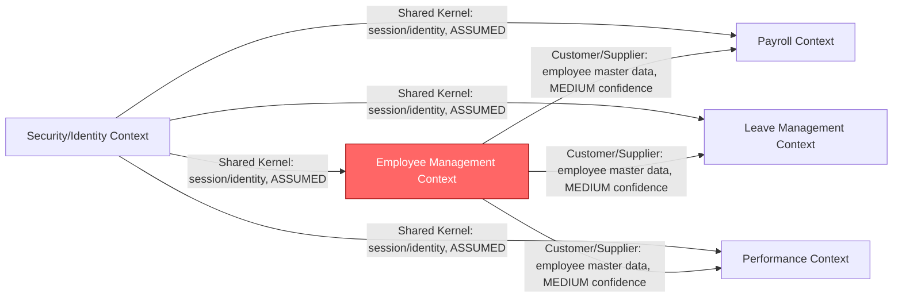

# Domain Model (DDD)

## Confidence note
No layer explicitly proposed bounded contexts. The contexts below are an **ASSUMED (ASMP-003)** structural mapping from the six confirmed value streams, offered as a starting point for Part 2 — not a validated DDD model.

## Bounded Contexts (proposed, ASSUMED)

1. **Employee Management Context** — owns the Employee aggregate (EMPLOYEES, EMPLOYEE_HISTORY). Confidence: MEDIUM for context boundary, HIGH for the two tables inside it.
2. **Leave Management Context** — owns Leave Request concepts. Confidence: LOW (no table evidence; inferred entirely from the value-stream name and the pain-point description).
3. **Payroll Context** — owns Pay Period and Payroll Run concepts. Confidence: LOW (name only).
4. **Performance Context** — owns Review Cycle and Individual Review concepts. Confidence: LOW (name only).
5. **Security/Identity Context** — owns authentication (`PKG_SECURITY`). Not named as a value stream by BA at all; identified here only because DA's evidence requires it to exist somewhere. Confidence: MEDIUM for existence, LOW for boundary placement. Flagged as OQ-011: BA's business capability model has no visibility into this context despite it being business-critical (nothing works without login).

## Context Map (Mermaid)

`EMP` is marked broken because its core lifecycle write path (`TRG_EMP_BEFORE_UPDATE`) fails on every invocation beyond initial hire.

## Aggregate: Employee (canonical, HIGH confidence)
- **Root entity:** Employee (table: EMPLOYEES)
- **Related entity:** EmployeeHistory (table: EMPLOYEE_HISTORY) — write path currently broken
- **Invariants known:** hire-date threshold rule exists but its value is disputed (90 vs 180 days, DISC-001)
- **Known defect:** state-changing operations (transfer/promote/terminate/rehire) cannot persist history due to trigger defect

## What is missing
- Aggregate boundaries for Leave Request, Pay Period, Payroll Run, Review — no table-level evidence was provided for any of these.
- Ubiquitous language glossary beyond the terms already used in the four summaries.