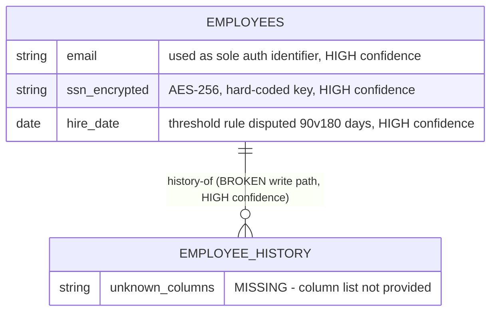

# Entity Relationship Diagram

## Confidence note
Only one relationship is directly evidenced: EMPLOYEES → EMPLOYEE_HISTORY (a history/audit relationship, currently broken at the trigger level). All other relationships below are marked per their confidence level; nothing is asserted without a source.

## Everything else — MISSING
No relationships involving Leave Request, Pay Period, Payroll Run, Review Cycle, Individual Review, or any of the other 28 tables were evidenced in the material provided to this synthesis. Drawing them would require inventing table/column names, which violates Rule 1 (never invent facts). These are tracked as OQ-006.