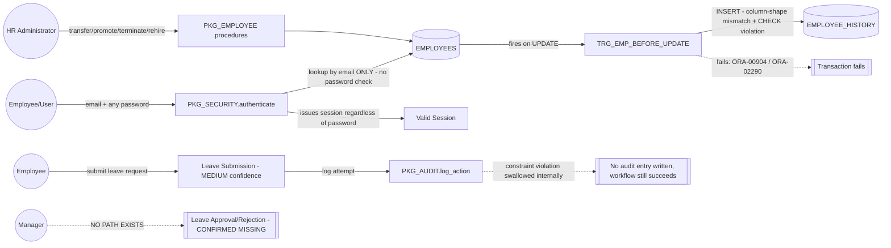

# Data Flow Diagram

## Confirmed flows (HIGH confidence)

## What is missing
Data flows for Pay Period, Payroll Run, Review Cycle, and Individual Review value streams were not evidenced in the material provided — no source/target tables or packages were named for these. See OQ-003/OQ-010.