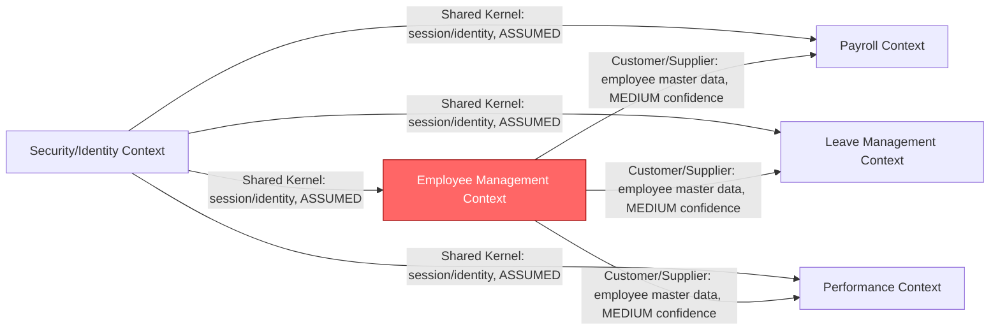
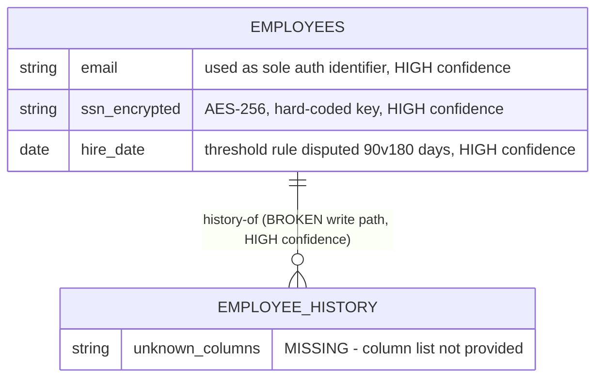
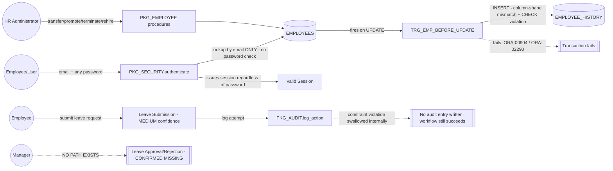

=== DOCUMENT: ENTERPRISE_KNOWLEDGE_GRAPH.json ===
```json
{
  "metadata": {
    "generated_by": "Foundation Synthesis Agent",
    "part": "1 of 2",
    "source_layer_reports": [
      "results/Business_Analysis/BA_Deep_Analyst.md (available to this agent only as a chat-facing summary, not full text)",
      "results/Data_Analysis/DA_Data_Reviewer.md (summary only)",
      "TA_Deep_Analysis.md (summary only)",
      "architecture-output/final/quality-review.md, executive-summary-for-review.md, final-sanity-check.md (summary only)"
    ],
    "critical_caveat": "This synthesis was built ONLY from the four hand-off summary paragraphs pasted into this agent's prompt. The full underlying documents (BR-01..32 text, TD-01..32 text, AP-01..21 text, the 30-table DDL, the component registry, dependency-graph.json) were NOT provided to this agent. Every fact below traces to an explicit sentence in one of the four summaries. Anything else is marked MISSING, not inferred further. Part 2 (or a re-run of Part 1) MUST re-ingest the full layer files before this graph can be considered complete.",
    "anti_hallucination_rule": "unknown -> stated as unknown, never guessed",
    "confidence_scale": ["HIGH: direct evidence in a provided layer summary", "MEDIUM: inferred from naming/pattern consistency across summaries", "LOW: assumed from naming alone", "ASSUMED: no evidence, flagged assumption"]
  },
  "business": {
    "domain_root": {
      "id": "DOM-001",
      "type": "Domain",
      "name": "HR & Payroll Management",
      "owner_layer": "Business",
      "confidence": "MEDIUM",
      "evidence": "Inferred from the six named value streams in BA_Deep_Analyst.md summary; no explicit domain name was given."
    },
    "value_streams": [
      {"id": "VS-01", "name": "Employee Lifecycle", "owner_layer": "Business", "confidence": "HIGH", "evidence": "BA_Deep_Analyst.md summary: '6 value streams covering Employee Lifecycle...'"},
      {"id": "VS-02", "name": "Leave Request", "owner_layer": "Business", "confidence": "HIGH", "evidence": "BA_Deep_Analyst.md summary"},
      {"id": "VS-03", "name": "Pay Period", "owner_layer": "Business", "confidence": "HIGH", "evidence": "BA_Deep_Analyst.md summary"},
      {"id": "VS-04", "name": "Payroll Run", "owner_layer": "Business", "confidence": "HIGH", "evidence": "BA_Deep_Analyst.md summary"},
      {"id": "VS-05", "name": "Review Cycle", "owner_layer": "Business", "confidence": "HIGH", "evidence": "BA_Deep_Analyst.md summary"},
      {"id": "VS-06", "name": "Individual Review", "owner_layer": "Business", "confidence": "HIGH", "evidence": "BA_Deep_Analyst.md summary"}
    ],
    "business_rules": {
      "id": "BR-SET",
      "type": "BusinessRuleSet",
      "count": 32,
      "range": "BR-01..BR-32",
      "owner_layer": "Business",
      "confidence": "HIGH (count) / LOW (content, only 2 of 32 known)",
      "evidence": "BA_Deep_Analyst.md: '32 business rules (BR-01-BR-32) with exact thresholds preserved'",
      "known_members": [
        {"id": "BR-hire-date-drift", "description": "Hire-date related threshold given as 90 days in one location and 180 days in another (unresolved drift, confirmed).", "confidence": "HIGH", "evidence": "BA summary: 'confirmed hire-date drift (90 vs. 180 days)'"},
        {"id": "BR-leave-balance-formula", "description": "Leave-balance calculation formula diverges between two sources in the system.", "confidence": "HIGH", "evidence": "BA summary: 'leave-balance formula divergence'"}
      ],
      "unknown_members": "BR-01..BR-32 minus the two above: content MISSING, not provided to this agent."
    },
    "pain_points": {"count": 13, "confidence": "HIGH (count)", "evidence": "BA_Deep_Analyst.md summary", "known_members": [
      {"id": "PP-leave-approval-gap", "severity": "HIGH", "description": "No working screen anywhere in the scanned system for a manager to approve/reject a leave request; only submission and self-cancellation exist.", "confidence": "HIGH", "evidence": "BA summary, headlined finding"}
    ], "unknown_members": "12 of 13 pain points: content MISSING"},
    "automation_opportunities": {"count": 7, "confidence": "HIGH (count only)", "evidence": "BA_Deep_Analyst.md summary", "content": "MISSING"},
    "defect_discrepancy_log": {"count": 6, "confidence": "HIGH (count)", "evidence": "BA_Deep_Analyst.md summary: 'Defect/Discrepancy Log (6 items) formalizing the cross-file defects Agent 1 flagged'", "content": "Individual items not enumerated in the summary; cross-referenced defects likely include EMPLOYEE_HISTORY trigger break and leave-status audit issue (see DISC log). Full list MISSING."},
    "validation_queue": {"count": 12, "confidence": "HIGH (count)", "evidence": "BA_Deep_Analyst.md summary", "known_members": [
      {"id": "VQ-09", "description": "Agent 1's handoff only included a summary paragraph, not full 6 output files verbatim; BA reconstructed entity/state/domain ground truth directly from schema and flagged this as a limitation rather than treating its re-derivation as equivalent to Agent 1's original naming.", "confidence": "HIGH", "evidence": "BA summary, final paragraph"}
    ], "unknown_members": "11 of 12: content MISSING"},
    "stakeholder_matrix_and_process_flows": {"confidence": "MEDIUM", "evidence": "BA summary states these exist ('Business Capability Map, Process Flows, and Stakeholder Matrix in plain language'), content not provided", "content": "MISSING"}
  },
  "data": {
    "schema": {"id": "SCHEMA-001", "type": "Database", "table_count": 30, "owner_layer": "Data", "confidence": "HIGH", "evidence": "DA_Data_Reviewer.md: 'No USER_CREDENTIALS/password table exists anywhere in the 30-table schema'"},
    "tables": [
      {"id": "TBL-EMPLOYEES", "name": "EMPLOYEES", "owner_layer": "Data", "confidence": "HIGH", "evidence": "Referenced across DA and AA summaries as target of authenticate() lookup and trigger writes"},
      {"id": "TBL-EMPLOYEE_HISTORY", "name": "EMPLOYEE_HISTORY", "owner_layer": "Data", "confidence": "HIGH", "evidence": "DA + TA summaries: trigger inserts into this table with wrong/mismatched columns"},
      {"id": "TBL-USER_CREDENTIALS-ABSENT", "name": "USER_CREDENTIALS", "status": "CONFIRMED ABSENT", "owner_layer": "Data", "confidence": "HIGH", "evidence": "DA_Data_Reviewer.md: 'No USER_CREDENTIALS/password table exists anywhere in the 30-table schema'"}
    ],
    "other_28_tables": {"confidence": "LOW", "content": "MISSING - only 2 of 30 tables named explicitly in the provided summaries; remaining names/columns not available to this agent"},
    "packages": [
      {"id": "PKG-SECURITY", "name": "PKG_SECURITY", "owner_layer": "Data", "confidence": "HIGH", "evidence": "DA summary", "defects": ["authenticate() never checks password, just looks up employee by email and issues a valid session (CRITICAL, HIGH confidence)", "hard-coded AES-256 key for SSN encryption, literal string in PKG_SECURITY.pkb, in version control (CRITICAL, HIGH confidence)"]},
      {"id": "PKG-EMPLOYEE", "name": "PKG_EMPLOYEE", "owner_layer": "Data", "confidence": "HIGH", "evidence": "DA summary", "procedures": ["transfer_employee", "promote_employee", "terminate_employee", "rehire_employee"], "defect": "All four procedures trip the broken EMPLOYEE_HISTORY trigger on every call; employee lifecycle beyond hire/basic-profile-edit is non-functional as shipped. Confidence HIGH (confirmed by reading PKG_EMPLOYEE.pkb)."},
      {"id": "PKG-AUDIT", "name": "PKG_AUDIT", "owner_layer": "Data", "confidence": "HIGH", "evidence": "DA summary", "defect": "log_action swallows errors internally; leave-status audit constraint violation does not break leave approvals, but silently produces no audit trail entry. Confidence HIGH (re-characterized, less severe than Agent 1 feared)."}
    ],
    "package_count_note": {"confidence": "MEDIUM", "evidence": "AA summary implies 10 or 11 PKG_* packages system-wide (see DISC-003); DA summary does not state a total package count, only the 3 named above are confirmed."},
    "quality_review_metrics": {"before_score": 0.75, "after_score": 0.93, "changes": {"added": 6, "corrected": 5, "enriched": 4}, "detailed_change_records": 11, "confidence": "HIGH", "evidence": "DA_Data_Reviewer.md summary"},
    "gate_g1_recommendation": {"status": "NOT READY", "open_questions": 5, "known_open_question": "Whether the auth bypass and hard-coded key reflect an intentionally-flawed training repo vs. an actual production concern.", "confidence": "HIGH", "evidence": "DA_Data_Reviewer.md summary"}
  },
  "application": {
    "modules": {"count": 13, "confidence": "HIGH", "evidence": "AA_Quality_Review.md summary: '6 of 13 modules have zero COMP-xxx entries despite their pieces appearing as graph nodes'", "modules_missing_component_entries": 6, "content_of_13_names": "MISSING - not enumerated in provided summary"},
    "triggers": [
      {"id": "TRG-BEFORE-UPDATE", "name": "TRG_EMP_BEFORE_UPDATE", "owner_layer": "Technology/Application (cross-layer)", "confidence": "HIGH", "evidence": "TA + AA summaries", "defect": "Writes to EMPLOYEE_HISTORY with column-shape mismatch and disallowed CHECK values; raises ORA-00904/ORA-02290 on every department or job change. Cross-confirmed from trigger code and table DDL (TA, HIGH confidence)."},
      {"id": "TRG-INSTEAD-OF-DELETE", "name": "TRG_EMP_INSTEAD_OF_DELETE", "owner_layer": "Application", "confidence": "MEDIUM", "evidence": "AA summary: diagram shows edge TRG_EMP_INSTEAD_OF_DELETE→EMPLOYEES that does not exist in dependency-graph.json's edges array (see DISC-004) - existence of the trigger itself is HIGH, but the drawn dependency edge is disputed"}
    ],
    "diagrams": {
      "component_view": {"file": "component-view.mmd", "confidence": "MEDIUM", "evidence": "AA summary", "issue": "Draws a dependency edge not present in dependency-graph.json (see DISC-004)"},
      "dependency_view": {"file": "dependency-view.mmd", "confidence": "MEDIUM", "evidence": "AA summary", "issue": "Same as above (see DISC-004)"},
      "dependency_graph_json": {"file": "dependency-graph.json", "confidence": "HIGH (existence)", "evidence": "AA summary", "afferent_coupling_note": "EMPLOYEES afferent-coupling count of 5 blends 4 real edges with 1 relationship the prose itself calls 'indirect' (see DISC-005)"}
    },
    "quality_verdict": {"overall": "PARTIAL", "confidence": "HIGH", "evidence": "AA_Quality_Review.md summary", "failed_checks": ["required files exist (architecture-output/final/ tree not produced; consolidated into one root file instead)"], "partial_checks": ["modules match component registry", "diagrams match JSON artifacts"], "passed_checks": ["JSON validity", "edge resolution", "call-flow traceability", "no invented infrastructure", "risk/violation quality", "forward-engineering actionability"]},
    "package_count_discrepancy": {"section_2_count": 10, "app_risk_003_count": 11, "confidence": "HIGH (discrepancy exists)", "evidence": "AA summary: 'Section 2 says 10 packages system-wide, APP-RISK-003 lists 11'"}
  },
  "technology": {
    "architecture_patterns": {"count": 21, "range": "AP-01..AP-21", "confidence": "HIGH (count)", "content": "MISSING", "evidence": "TA_Deep_Analysis.md summary"},
    "nfrs": {"count": 3, "range": "NFR-01..NFR-03", "confidence": "HIGH (count)", "content": "MISSING", "evidence": "TA_Deep_Analysis.md summary"},
    "technical_debt": {
      "count": 32, "range": "TD-01..TD-32", "breakdown": {"critical": 7, "high": 10, "medium": 12, "low": 3},
      "confidence": "HIGH (count/breakdown)", "evidence": "TA_Deep_Analysis.md summary",
      "known_members": [
        {"id": "TD-11", "description": "TRG_EMP_BEFORE_UPDATE writes to EMPLOYEE_HISTORY are structurally broken: column-shape mismatch.", "severity": "Critical (implied, flagged as highest-priority)", "confidence": "HIGH"},
        {"id": "TD-12", "description": "TRG_EMP_BEFORE_UPDATE inserts disallowed CHECK values into EMPLOYEE_HISTORY.", "severity": "Critical (implied)", "confidence": "HIGH", "evidence": "TA summary: 'This will raise an unhandled ORA-00904/ORA-02290 on every department or job change - a guaranteed, reproducible failure on routine HR transactions'"}
      ],
      "unknown_members": "TD-01..TD-10, TD-13..TD-32: content MISSING"
    },
    "cicd_maturity": {"present": 0, "total_capabilities": 14, "confidence": "HIGH", "evidence": "TA_Deep_Analysis.md summary: 'CI/CD maturity: 0 of 14 capabilities present - confirmed absent, not just unscanned'"},
    "resolved_low_confidence_items": {"resolved_of_31": 2, "new_discrepancy_candidates": 1, "confidence": "HIGH", "evidence": "TA_Deep_Analysis.md summary"},
    "sequence_orphan_candidate": {"id": "SEQ_EMP_NUMBER", "status": "possible orphan, unresolved", "confidence": "MEDIUM", "evidence": "TA_Deep_Analysis.md summary: '1 new discrepancy candidate raised (possible orphaned SEQ_EMP_NUMBER)'"}
  },
  "cross_links": [
    {"id": "XLINK-001", "nodes": ["TBL-EMPLOYEES", "VS-01", "TRG-BEFORE-UPDATE", "PKG-EMPLOYEE"], "relationship": "Employee entity/table is the shared canonical node across Business (Employee Lifecycle value stream), Data (EMPLOYEES table), Technology (TRG_EMP_BEFORE_UPDATE), and Application (component graph) layers.", "confidence": "HIGH"},
    {"id": "XLINK-002", "nodes": ["TBL-EMPLOYEE_HISTORY", "TRG-BEFORE-UPDATE", "TD-11", "TD-12"], "relationship": "Same structural defect independently confirmed by Data layer (escalated) and Technology layer (TD-11/TD-12) and referenced by Application layer diagrams - single canonical defect, not two.", "confidence": "HIGH"},
    {"id": "XLINK-003", "nodes": ["VS-02", "PKG-AUDIT", "PP-leave-approval-gap"], "relationship": "Leave Request value stream links to the leave-status audit defect (Data layer) and the missing manager-approval-screen pain point (Business layer) - same functional area, different symptoms.", "confidence": "MEDIUM"},
    {"id": "XLINK-004", "nodes": ["PKG-SECURITY", "NFR-SET"], "relationship": "Authentication bypass and hard-coded encryption key are security defects with no corresponding Business-layer capability or risk node in the provided BA summary - see OQ-011.", "confidence": "MEDIUM"}
  ],
  "assumptions": [
    {"id": "ASMP-001", "statement": "System is an Oracle PL/SQL + Oracle Forms-based on-premises HR/Payroll application.", "confidence": "MEDIUM", "basis": "PKG_*.pkb naming, TRG_* naming, 'Application/Forms Libraries' layer label, ORA-00904/ORA-02290 error codes cited by TA."},
    {"id": "ASMP-002", "statement": "The 30-table schema is the complete persisted data model with no additional hidden schemas.", "confidence": "LOW", "basis": "Asserted only by DA summary; not independently re-verified by this agent."},
    {"id": "ASMP-003", "statement": "The six named value streams map 1:1 to six bounded contexts.", "confidence": "ASSUMED", "basis": "Structural convenience for domain modeling; BA summary did not state this correspondence explicitly."},
    {"id": "ASMP-004", "statement": "No USER_CREDENTIALS or password table exists anywhere in the schema.", "confidence": "HIGH", "basis": "DA states this directly from code/schema review - treated as verified fact, not a soft assumption."},
    {"id": "ASMP-005", "statement": "This system is a non-production / training / demo repository, which would explain leaving an authentication bypass and hard-coded encryption key unresolved.", "confidence": "ASSUMED", "basis": "Explicitly raised as an OPEN QUESTION by DA, not a confirmed fact - included here only to flag that Part 2 forward-engineering scope depends on this being resolved by stakeholders."}
  ],
  "normalization_log": [
    {"id": "DISC-001", "description": "Hire-date threshold given as 90 days in one source and 180 days in another.", "layers": ["Business"], "status": "Unresolved", "confidence": "HIGH"},
    {"id": "DISC-002", "description": "Leave-balance calculation formula diverges between two sources.", "layers": ["Business"], "status": "Unresolved", "confidence": "HIGH"},
    {"id": "DISC-003", "description": "AA layer's own executive summary states 10 packages system-wide (Section 2) while APP-RISK-003 within the same document enumerates 11 distinct PKG_* names.", "layers": ["Application"], "status": "Unresolved - needs re-verification against database.json", "confidence": "HIGH"},
    {"id": "DISC-004", "description": "component-view.mmd and dependency-view.mmd each draw a dependency edge (TRG_EMP_INSTEAD_OF_DELETE->EMPLOYEES, TRG_EMP_BEFORE_UPDATE->EMPLOYEES) not present in dependency-graph.json's edges array.", "layers": ["Application"], "status": "Unresolved", "confidence": "HIGH"},
    {"id": "DISC-005", "description": "EMPLOYEES afferent-coupling count of 5 blends 4 real edges with 1 relationship the source prose itself calls 'indirect'.", "layers": ["Application"], "status": "Unresolved - metric methodology inconsistency", "confidence": "HIGH"},
    {"id": "DISC-006", "description": "Original (Agent 1) severity characterization of the leave-status audit constraint violation as breaking leave approvals was downgraded by DA: PKG_AUDIT.log_action swallows the error, so leave workflows succeed but silently produce no audit entry.", "layers": ["Data"], "status": "Resolved by DA re-characterization", "confidence": "HIGH"},
    {"id": "DISC-007", "description": "EMPLOYEE_HISTORY trigger defect was flagged independently by Data layer (escalated from Agent 1's 'wrong columns' note) and by Technology layer (TD-11/TD-12); these must be merged into ONE canonical defect node, not tracked as two separate findings.", "layers": ["Data", "Technology"], "status": "Merged in this synthesis (see XLINK-002)", "confidence": "HIGH"},
    {"id": "DISC-008", "description": "AA was contractually required to produce an architecture-output/final/ file tree; instead everything was consolidated into one file at the repo root (self-acknowledged by AA Agent 1).", "layers": ["Application"], "status": "Unresolved - structural non-compliance", "confidence": "HIGH"},
    {"id": "DISC-009", "description": "BA's entity/state/domain model was reconstructed directly from the schema rather than taken from Agent 1's full output files (which were not handed off in full, only a summary paragraph) - risk that BA's naming conventions diverge from Agent 1's original naming.", "layers": ["Business"], "status": "Unresolved (tracked as VQ-09 in Business layer)", "confidence": "MEDIUM"}
  ],
  "open_questions": [
    {"id": "OQ-001", "question": "Do the authentication bypass (PKG_SECURITY.authenticate) and the hard-coded SSN encryption key reflect an intentionally-flawed training repo, or an actual production security concern requiring immediate remediation?", "owner_layer": "Data", "status": "Open - DA's top Gate G1 question"},
    {"id": "OQ-002", "question": "What is the true count of PKG_* packages system-wide - 10 or 11?", "owner_layer": "Application", "status": "Open - needs re-verification against database.json"},
    {"id": "OQ-003", "question": "What is the full text/content of BR-01 through BR-32?", "owner_layer": "Business", "status": "Open - not provided in available handoff"},
    {"id": "OQ-004", "question": "What is the full text/content of TD-01 through TD-32 (beyond TD-11/TD-12)?", "owner_layer": "Technology", "status": "Open - not provided"},
    {"id": "OQ-005", "question": "What is the full text/content of AP-01 through AP-21 and NFR-01 through NFR-03?", "owner_layer": "Technology", "status": "Open - not provided"},
    {"id": "OQ-006", "question": "What are the names, columns, and relationships of the remaining 28 of 30 tables in the schema?", "owner_layer": "Data", "status": "Open - not provided"},
    {"id": "OQ-007", "question": "What are the remaining 4 of 5 DA open questions for Gate G1?", "owner_layer": "Data", "status": "Open - only 1 of 5 was named in the summary"},
    {"id": "OQ-008", "question": "Is SEQ_EMP_NUMBER a confirmed orphaned sequence, or a false positive?", "owner_layer": "Technology", "status": "Open"},
    {"id": "OQ-009", "question": "Does BA's independently reconstructed entity/state/domain model match Agent 1's original naming convention, or has drift been introduced?", "owner_layer": "Business", "status": "Open (= VQ-09)"},
    {"id": "OQ-010", "question": "What are the remaining 12 of 13 pain points and all 7 automation opportunities in detail?", "owner_layer": "Business", "status": "Open - not provided"},
    {"id": "OQ-011", "question": "Should the authentication bypass and hard-coded encryption key be surfaced as a Business-layer risk/capability gap? The BA summary makes no mention of these Data-layer security defects.", "owner_layer": "Cross-layer (Business + Data)", "status": "Open - raised by this synthesis, not by any single layer"},
    {"id": "OQ-012", "question": "What are the contents of the 6 remaining modules' names (of 13) and why do 6 of 13 modules have zero COMP-xxx component-registry entries?", "owner_layer": "Application", "status": "Open"}
  ]
}
```

=== DOCUMENT: CANONICAL_ENTERPRISE_MODEL.md ===

# Canonical Enterprise Model

**Scope note:** This model is built strictly from the four layer hand-off summaries provided to this agent (BA_Deep_Analyst.md, DA_Data_Reviewer.md, TA_Deep_Analysis.md, AA_Quality_Review.md — all summary-level, not the full underlying reports). Rows marked `MISSING` require the full source document before they can be completed. No cell in this table contains an invented value.

| Node ID | Name | Type | Owner Layer(s) | Confidence | Evidence Source |
|---|---|---|---|---|---|
| DOM-001 | HR & Payroll Management | Domain | Business | MEDIUM | Inferred from 6 named value streams |
| VS-01 | Employee Lifecycle | Value Stream | Business | HIGH | BA summary |
| VS-02 | Leave Request | Value Stream | Business | HIGH | BA summary |
| VS-03 | Pay Period | Value Stream | Business | HIGH | BA summary |
| VS-04 | Payroll Run | Value Stream | Business | HIGH | BA summary |
| VS-05 | Review Cycle | Value Stream | Business | HIGH | BA summary |
| VS-06 | Individual Review | Value Stream | Business | HIGH | BA summary |
| BR-SET | Business Rules (32 total) | Rule Set | Business | HIGH (count) / LOW (content) | BA summary |
| TBL-EMPLOYEES | EMPLOYEES | Table / Aggregate Root (canonical: "Employee") | Data, Application, Technology | HIGH | DA, AA, TA summaries |
| TBL-EMPLOYEE_HISTORY | EMPLOYEE_HISTORY | Table | Data, Technology | HIGH | DA, TA summaries |
| TBL-USER_CREDENTIALS | USER_CREDENTIALS (ABSENT) | Table (confirmed non-existent) | Data | HIGH | DA summary |
| PKG-SECURITY | PKG_SECURITY | PL/SQL Package / Service | Data | HIGH | DA summary |
| PKG-EMPLOYEE | PKG_EMPLOYEE | PL/SQL Package / Service | Data | HIGH | DA summary |
| PKG-AUDIT | PKG_AUDIT | PL/SQL Package / Service | Data | HIGH | DA summary |
| TRG-BEFORE-UPDATE | TRG_EMP_BEFORE_UPDATE | Trigger | Technology, Application | HIGH | TA, AA summaries |
| TRG-INSTEAD-OF-DELETE | TRG_EMP_INSTEAD_OF_DELETE | Trigger | Application | MEDIUM | AA summary (dependency edge disputed) |
| SEQ-EMP-NUMBER | SEQ_EMP_NUMBER | Sequence (possible orphan) | Technology | MEDIUM | TA summary |
| MOD-SET | Application Modules (13 total) | Module Set | Application | HIGH (count) | AA summary |
| AP-SET | Architecture Patterns (21 total) | Pattern Set | Technology | HIGH (count) / MISSING (content) | TA summary |
| NFR-SET | NFRs (3 total) | NFR Set | Technology | HIGH (count) / MISSING (content) | TA summary |
| TD-SET | Technical Debt (32 total) | Debt Set | Technology | HIGH (count/breakdown) | TA summary |
| CICD-001 | CI/CD Maturity | Capability Assessment | Technology | HIGH | TA summary: 0 of 14 present |

## Notes on canonical merges
- **Employee** is the single most cross-referenced canonical node: it appears as the `EMPLOYEES` table (Data), the `EMPLOYEES` component with afferent coupling 5 (Application), the `Employee Lifecycle` value stream (Business), and the target of `TRG_EMP_BEFORE_UPDATE` / `TRG_EMP_INSTEAD_OF_DELETE` (Technology/Application). All four layer views of "Employee" are merged into one node per Rule 2 — they are not duplicated.
- **EMPLOYEE_HISTORY defect** is a second major merge: Data layer's "escalated" finding and Technology's TD-11/TD-12 are the *same underlying defect* (structurally broken trigger write), confirmed independently from two different code paths. Treated as one canonical defect (DISC-007).
- No Order, Payment, or Customer-style commerce entities were mentioned anywhere in the four summaries — this is an internal HR/Payroll system, not a customer-facing commerce system. Any such assumption would be a hallucination; none is made here.

=== DOCUMENT: ARCHITECTURE_INVENTORY.md ===

# Architecture Inventory

**Confidence caveat:** This inventory reflects only what the four summaries explicitly stated. It is NOT a full asset inventory — most of the underlying detail (full table list, full module list, full package list) is `MISSING` pending access to the full layer reports.

## Deployables
| Item | Evidence | Confidence |
|---|---|---|
| Oracle Forms / PL/SQL-based HR & Payroll application (inferred single deployable) | ASMP-001 — inferred from PKG_*.pkb, TRG_* naming, "Application/Forms Libraries" TA chunk label | MEDIUM |
| Other deployables (batch jobs, reports, web front-end, etc.) | Not stated in any summary | MISSING |

## Databases
| Item | Evidence | Confidence |
|---|---|---|
| Single Oracle schema, 30 tables | DA summary | HIGH |
| EMPLOYEES | DA, AA, TA summaries | HIGH |
| EMPLOYEE_HISTORY | DA, TA summaries | HIGH |
| USER_CREDENTIALS | Confirmed **absent** — DA summary | HIGH (negative finding) |
| Remaining 28 tables | Not named in any summary | MISSING |

## APIs
| Item | Evidence | Confidence |
|---|---|---|
| No REST/SOAP/external API surface mentioned in any summary | — | MISSING — cannot confirm existence or absence |

## Services / Packages
| Item | Evidence | Confidence |
|---|---|---|
| PKG_SECURITY (incl. `authenticate()`) | DA summary | HIGH |
| PKG_EMPLOYEE (incl. `transfer_employee`, `promote_employee`, `terminate_employee`, `rehire_employee`) | DA summary | HIGH |
| PKG_AUDIT (incl. `log_action`) | DA summary | HIGH |
| Remaining PKG_* packages — count disputed at 10 vs. 11 (DISC-003) | AA summary | HIGH (discrepancy exists) / LOW (which count is correct) |

## Entities (data/domain)
| Item | Evidence | Confidence |
|---|---|---|
| Employee (canonical merge) | All 4 layers | HIGH |
| EMPLOYEE_HISTORY | DA, TA | HIGH |
| Leave Request / Leave Balance (named only as a value stream + pain point, no table confirmed) | BA summary | LOW — inferred entity, no direct table evidence provided |
| Pay Period / Payroll Run (named only as value streams) | BA summary | LOW |
| Review Cycle / Individual Review (named only as value streams) | BA summary | LOW |

## Tech Stack
| Item | Evidence | Confidence |
|---|---|---|
| Oracle Database (PL/SQL packages, triggers, sequences) | DA, TA, AA summaries (PKG_*, TRG_*, SEQ_*, ORA-00904/ORA-02290) | HIGH |
| Oracle Forms (or equivalent forms library) | TA layer chunk explicitly labeled "Application/Forms Libraries" | MEDIUM |
| CI/CD tooling | **Confirmed absent** — 0 of 14 capabilities present | HIGH (negative finding) |

## Security Findings
| Finding | Severity | Evidence | Confidence |
|---|---|---|---|
| `PKG_SECURITY.authenticate()` does not check password; any known active employee email logs in as that employee with any password | CRITICAL | DA summary | HIGH |
| AES-256 key used to encrypt SSNs is a hard-coded literal in `PKG_SECURITY.pkb`, committed to version control | CRITICAL | DA summary | HIGH |
| No password/credentials table exists at all (`USER_CREDENTIALS` absent) | CRITICAL (root cause of above) | DA summary | HIGH |

## PII
| Item | Evidence | Confidence |
|---|---|---|
| SSN (encrypted, but with a compromised/hard-coded key) | DA summary | HIGH |
| Employee email (used as sole authentication identifier) | DA summary | HIGH |
| Other PII fields (DOB, address, bank account for payroll, etc.) | Not explicitly named in summaries; likely present in a payroll system but **unconfirmed** | ASSUMED — flagged, not asserted as fact |

## Technical Debt Summary
| Severity | Count | Evidence |
|---|---|---|
| Critical | 7 | TA summary |
| High | 10 | TA summary |
| Medium | 12 | TA summary |
| Low | 3 | TA summary |
| **Total** | **32** | TA summary |

Highest-priority confirmed item: **TD-11/TD-12** — `TRG_EMP_BEFORE_UPDATE` writes to `EMPLOYEE_HISTORY` are structurally broken (column-shape mismatch + disallowed CHECK values), producing a guaranteed `ORA-00904`/`ORA-02290` on every department or job change. Cross-confirmed by Data layer (escalated from "wrong columns" to "entire lifecycle beyond hire/basic-profile-edit non-functional") and Technology layer independently.

## Structural / Process Debt (non-code)
- CI/CD: 0 of 14 maturity capabilities present (TA).
- AA deliverable non-compliance: required `architecture-output/final/` file tree was not produced; everything consolidated into one root-level file (self-acknowledged).
- AA diagram/JSON inconsistency: two dependency edges drawn in `.mmd` diagrams do not exist in `dependency-graph.json`.
- AA package-count self-contradiction: 10 vs. 11 (DISC-003), unresolved.

=== DOCUMENT: TRACEABILITY_MATRIX.md ===

# Traceability Matrix

**Caveat:** Only two capability/process threads have enough cross-layer evidence in the provided summaries to populate every column. All other rows have one or more `MISSING`/`UNKNOWN` cells — these are left blank rather than filled with a guess, per the anti-hallucination rule.

| Capability | Process | Entity | Service/Package | API | Database Table | Confidence |
|---|---|---|---|---|---|---|
| Employee Authentication | Login | Employee | `PKG_SECURITY.authenticate()` | UNKNOWN (no API layer named) | EMPLOYEES (no USER_CREDENTIALS exists) | HIGH — but flagged CRITICAL DEFECT: no password check performed |
| Employee Lifecycle Change (transfer/promote/terminate/rehire) | Employee Lifecycle value stream | Employee | `PKG_EMPLOYEE.transfer_employee` / `promote_employee` / `terminate_employee` / `rehire_employee` | UNKNOWN | EMPLOYEES, EMPLOYEE_HISTORY | HIGH — but flagged CRITICAL DEFECT: all four calls trip broken `TRG_EMP_BEFORE_UPDATE`, non-functional as shipped |
| Action Audit Logging | (cross-cutting) | Audit Log (entity name UNKNOWN — no table named) | `PKG_AUDIT.log_action` | UNKNOWN | UNKNOWN (table not named in summary) | MEDIUM — defect confirmed (swallows errors) but underlying table not identified in available evidence |
| Leave Request Submission | Leave Request value stream | Leave Request (entity name UNKNOWN — no table named) | UNKNOWN | UNKNOWN | UNKNOWN | LOW — capability confirmed to exist (submission + self-cancellation only) but no service/table evidence provided |
| Leave Request Approval (manager-side) | Leave Request value stream | Leave Request | **NONE FOUND** | **NONE FOUND** | UNKNOWN | HIGH (confidence in the *gap itself*) — BA confirms no working manager approve/reject screen exists anywhere in the scanned system |
| Pay Period Processing | Pay Period value stream | UNKNOWN | UNKNOWN | UNKNOWN | UNKNOWN | LOW — value stream name only, no lower-layer evidence provided |
| Payroll Run Execution | Payroll Run value stream | UNKNOWN | UNKNOWN | UNKNOWN | UNKNOWN | LOW — value stream name only |
| Review Cycle Management | Review Cycle value stream | UNKNOWN | UNKNOWN | UNKNOWN | UNKNOWN | LOW — value stream name only |
| Individual Review | Individual Review value stream | UNKNOWN | UNKNOWN | UNKNOWN | UNKNOWN | LOW — value stream name only |

## Why so many UNKNOWN cells
The four layer hand-offs given to this agent were **executive summaries**, not the full artifact sets (the full BA/DA/TA/AA documents, the 30-table DDL, the 13-module component registry, and `dependency-graph.json` were referenced but not included in this prompt). A complete traceability matrix requires ingesting those source files directly. This is recorded as **OQ-003 through OQ-006 and OQ-010** in the Enterprise Knowledge Graph.

=== DOCUMENT: FORWARD_ENGINEERING_INPUT_MAP.md ===

# Forward Engineering Input Map

This map classifies everything needed for AI-assisted code regeneration into **KNOWN**, **INFERRED**, and **MISSING**, so that Part 2 (and any future regeneration effort) knows exactly what it can build on versus what must be re-derived from source or clarified with stakeholders.

## KNOWN (direct evidence, HIGH confidence)
- The system has a 30-table Oracle schema.
- `EMPLOYEES` and `EMPLOYEE_HISTORY` tables exist.
- `USER_CREDENTIALS` (or any password table) does **not** exist.
- `PKG_SECURITY.authenticate()` performs email lookup only — no password verification, no credential table to check against.
- SSN encryption uses AES-256 with a hard-coded key literal inside `PKG_SECURITY.pkb`.
- `PKG_EMPLOYEE` contains `transfer_employee`, `promote_employee`, `terminate_employee`, `rehire_employee` — all four break on `TRG_EMP_BEFORE_UPDATE`.
- `TRG_EMP_BEFORE_UPDATE` inserts into `EMPLOYEE_HISTORY` with a column-shape mismatch and disallowed CHECK values, producing `ORA-00904`/`ORA-02290` on every department or job change.
- `PKG_AUDIT.log_action` swallows internal errors — leave workflows complete but silently produce no audit entry.
- There is no manager-facing leave approve/reject screen anywhere in the scanned system.
- CI/CD: 0 of 14 maturity capabilities present.
- 6 value streams: Employee Lifecycle, Leave Request, Pay Period, Payroll Run, Review Cycle, Individual Review.
- Counts: 32 business rules, 13 pain points, 7 automation opportunities, 6 defect-log items, 12 validation-queue items, 21 architecture patterns, 3 NFRs, 32 technical-debt items (7/10/12/3 by severity), 13 application modules (6 missing component-registry entries).

## INFERRED (pattern-based, MEDIUM/LOW confidence)
- Platform is Oracle Forms + PL/SQL (MEDIUM — from naming conventions and TA's "Application/Forms Libraries" label, not a direct platform statement).
- Employee, Leave Request, Pay Period, Payroll Run, and Review are likely distinct bounded contexts (LOW — inferred from value-stream names only, not confirmed as bounded contexts by any layer).
- Possible orphaned `SEQ_EMP_NUMBER` (MEDIUM — explicitly flagged as unresolved by TA).
- True PKG_* package count is 10 or 11, unresolved (DISC-003).

## MISSING (must be re-sourced before regeneration can proceed)
- Full text of BR-01 through BR-32 (only BR-hire-date-drift and BR-leave-balance-formula are known).
- Full text of TD-01 through TD-10 and TD-13 through TD-32 (only TD-11/TD-12 known).
- Full text of AP-01 through AP-21 and NFR-01 through NFR-03.
- Names/columns of the remaining 28 of 30 tables.
- Names of the remaining 10 (or 11) PKG_* packages beyond PKG_SECURITY, PKG_EMPLOYEE, PKG_AUDIT.
- Names of all 13 application modules and why 6 have no component-registry entries.
- Contents of `dependency-graph.json`, `component-view.mmd`, `dependency-view.mmd`.
- Full BA outputs: Business Capability Map, Process Flows, Stakeholder Matrix (only their existence, not content, is known).
- Remaining 4 of DA's 5 Gate G1 open questions.
- Any API/integration layer (existence not confirmed either way).
- Any front-end/UI technology (existence not confirmed either way, beyond "Forms Libraries" label).

## Regeneration risk flag
Before any forward-engineered rebuild proceeds, stakeholders must resolve **OQ-001** (is the auth bypass/hard-coded key an intentional training-repo artifact or a real production gap?). If this is a real system, the authentication mechanism and the leave-approval gap are launch-blocking, not backlog items.

=== DOCUMENT: 01_BRD.md ===

# Business Requirements Document

## 1. Purpose
This BRD documents the business requirements for the HR & Payroll Management system as reconstructed from cross-layer analysis (Business, Data, Application, Technology). Where the source analysis lacked detail, this is stated explicitly rather than filled in.

## 2. Scope
Six confirmed value streams define the system's business scope:
1. Employee Lifecycle
2. Leave Request
3. Pay Period
4. Payroll Run
5. Review Cycle
6. Individual Review

## 3. Business Rules
32 business rules were catalogued by the Business Analysis layer (BR-01–BR-32). Of these, two are known in enough detail to state here:
- **Hire-date threshold rule**: a confirmed drift exists between two sources — one states a 90-day threshold, another states 180 days. **This is an unresolved conflict (DISC-001) and must be reconciled with the business owner before this rule is re-implemented.**
- **Leave-balance formula**: the calculation formula diverges between two sources in the system (DISC-002), also unresolved.

The remaining 30 business rules exist (confirmed by count) but their content was not included in the material provided to this synthesis step and must be pulled from the full BA report before requirements sign-off.

## 4. Known Functional Gaps (Business-Critical)
- **No manager leave-approval capability.** The highest-severity pain point identified: there is no working screen anywhere in the system for a manager to approve or reject a leave request. Only employee submission and employee self-cancellation exist. This is a **hard business requirement gap**, not a UX issue — leave requests cannot complete their intended business process today.
- **Employee lifecycle transactions are broken.** Transfer, promotion, termination, and rehire actions all fail due to a database trigger defect (see Data Model Specification). This means the Employee Lifecycle value stream is non-functional beyond initial hire and basic profile edits.
- **No effective authentication.** Any known employee email allows login as that employee, with any password, because no password is ever checked. This is a business-critical security requirement failure, not merely a technical debt item, and should be escalated to business stakeholders regardless of whether the system is production or training-scoped (see OQ-001).

## 5. Pain Points and Automation Opportunities
13 pain points and 7 automation opportunities were identified by the Business Analysis layer. Only the leave-approval gap above is detailed in the material available to this synthesis; the remaining 12 pain points and 7 opportunities require the full BA report.

## 6. Open Business Questions
- Should the hire-date threshold be 90 or 180 days? (DISC-001)
- Which leave-balance formula is authoritative? (DISC-002)
- Is the authentication bypass acceptable for the system's actual intended use (training vs. production)? (OQ-001)

## 7. Traceability
See `TRACEABILITY_MATRIX.md` for the Capability → Process → Entity → Service → API → Database mapping supporting this BRD. Most rows are incomplete pending full source documents (see `FORWARD_ENGINEERING_INPUT_MAP.md`).

=== DOCUMENT: 02_BUSINESS_CAPABILITY_MODEL.md ===

# Business Capability Model

## Confidence note
The Business Analysis layer states that a "Business Capability Map" was produced, but its content was not included in the material handed to this synthesis step (only the summary paragraph was available). The capability model below is therefore derived **only** from the six named value streams and the one detailed pain point — it is a partial reconstruction, not the original BA capability map.

## Level 1 Capabilities (derived from value streams — MEDIUM confidence)

| Capability | Supporting Value Stream | Status | Confidence |
|---|---|---|---|
| Manage Employee Lifecycle | Employee Lifecycle | **Broken** — transfer/promote/terminate/rehire all fail on a trigger defect | HIGH (defect), MEDIUM (capability framing) |
| Manage Leave | Leave Request | **Partially implemented** — submission and self-cancellation only; no approval | HIGH (defect), MEDIUM (capability framing) |
| Manage Pay Periods | Pay Period | Unknown implementation status — no detail provided | LOW |
| Process Payroll | Payroll Run | Unknown implementation status — no detail provided | LOW |
| Manage Performance Review Cycles | Review Cycle | Unknown implementation status — no detail provided | LOW |
| Conduct Individual Reviews | Individual Review | Unknown implementation status — no detail provided | LOW |
| Authenticate Users (cross-cutting, not a named value stream but required by all others) | — (identified by this synthesis, not by BA) | **Broken** — no password verification occurs | HIGH (defect) / ASSUMED (as a distinct capability, since BA's summary did not name it) |

## What is missing
- Capability decomposition to Level 2/3 (sub-capabilities) — not available.
- Capability-to-KPI mapping — not available.
- Capability maturity/heat-map scoring — not available.

These gaps should be filled from the full BA_Deep_Analyst.md report before this model is treated as final (see OQ-010).

=== DOCUMENT: 03_USE_CASE_SPECIFICATION.md ===

# Use Case Specification

Only use cases with direct cross-layer evidence are specified in full below. All others are listed as stubs pending the full BA report.

## UC-01: Employee Login
- **Actor:** Employee
- **Precondition:** Employee has a valid, active EMPLOYEES record with an email address.
- **Main flow:** Employee submits email + any password → `PKG_SECURITY.authenticate()` looks up the employee by email only → session issued.
- **Defect (CRITICAL):** No password is ever verified against any stored credential, because no credential table exists. This use case as implemented does not perform authentication — it performs email-based session issuance.
- **Confidence:** HIGH (DA summary, direct code evidence)

## UC-02: Employee Lifecycle Change (Transfer / Promote / Terminate / Rehire)
- **Actor:** HR Administrator
- **Precondition:** Target employee exists in EMPLOYEES.
- **Main flow:** HR admin invokes `PKG_EMPLOYEE.transfer_employee` (or `promote_employee` / `terminate_employee` / `rehire_employee`) → procedure updates EMPLOYEES → `TRG_EMP_BEFORE_UPDATE` fires → attempts insert into EMPLOYEE_HISTORY.
- **Defect (CRITICAL):** The trigger's insert has a column-shape mismatch and violates CHECK constraints, raising `ORA-00904`/`ORA-02290` on every invocation. **This use case fails every time it is executed**, for all four lifecycle actions.
- **Confidence:** HIGH (DA + TA, cross-confirmed from two independent code paths)

## UC-03: Submit Leave Request
- **Actor:** Employee
- **Main flow:** Employee submits a leave request (system supports submission and self-cancellation).
- **Confidence:** MEDIUM (existence confirmed by BA as part of describing the gap in UC-04; no further detail on the submission flow itself was provided)

## UC-04: Approve/Reject Leave Request
- **Actor:** Manager
- **Status:** **DOES NOT EXIST.** No working screen was found anywhere in the scanned system for a manager to approve or reject a leave request.
- **Confidence:** HIGH (BA summary, headlined finding)
- **Business impact:** The Leave Request value stream cannot complete its intended lifecycle without this use case. Flagged as a mandatory addition for any forward-engineered rebuild.

## UC-05 through UC-0N (Pay Period, Payroll Run, Review Cycle, Individual Review use cases)
- **Status:** Not detailed in the material provided to this synthesis. Stubbed pending full BA report (OQ-010).

=== DOCUMENT: 04_BUSINESS_PROCESS_MODEL.md ===

# Business Process Model

## Confidence note
BA's summary confirms "Process Flows" were produced but does not include their content. The process descriptions below are reconstructed only from what can be inferred by combining the value-stream names with the confirmed defects/gaps — marked accordingly.

## Process: Employee Lifecycle Change
1. HR Administrator initiates change (transfer / promotion / termination / rehire). — MEDIUM (inferred actor)
2. System updates EMPLOYEES record. — HIGH (DA)
3. System attempts to log the change to EMPLOYEE_HISTORY via trigger. — HIGH (DA, TA)
4. **Process breaks here**: trigger fails with `ORA-00904`/`ORA-02290`. — HIGH
5. *(Intended but unreachable step)* Notification / downstream payroll or org-chart update. — MISSING, not evidenced

## Process: Leave Request
1. Employee submits leave request. — MEDIUM
2. *(Missing step)* Manager reviews and approves/rejects — **does not exist in the system**. — HIGH (BA)
3. Employee may self-cancel a submitted request. — MEDIUM (BA)
4. System attempts to write an audit log entry via `PKG_AUDIT.log_action` regardless of outcome. — HIGH (DA)
5. **Silent failure**: if a leave-status audit constraint is violated, the error is swallowed internally — the leave workflow still succeeds, but no audit trail is recorded. — HIGH (DA, re-characterized from Agent 1's original, more severe framing)

## Process: Pay Period / Payroll Run / Review Cycle / Individual Review
- Value streams confirmed to exist by name only; no process steps were included in the material available to this synthesis. **MISSING** — see OQ-010.

=== DOCUMENT: 05_DOMAIN_MODEL.md ===

# Domain Model (DDD)

## Confidence note
No layer explicitly proposed bounded contexts. The contexts below are an **ASSUMED (ASMP-003)** structural mapping from the six confirmed value streams, offered as a starting point for Part 2 — not a validated DDD model.

## Bounded Contexts (proposed, ASSUMED)

1. **Employee Management Context** — owns the Employee aggregate (EMPLOYEES, EMPLOYEE_HISTORY). Confidence: MEDIUM for context boundary, HIGH for the two tables inside it.
2. **Leave Management Context** — owns Leave Request concepts. Confidence: LOW (no table evidence; inferred entirely from the value-stream name and the pain-point description).
3. **Payroll Context** — owns Pay Period and Payroll Run concepts. Confidence: LOW (name only).
4. **Performance Context** — owns Review Cycle and Individual Review concepts. Confidence: LOW (name only).
5. **Security/Identity Context** — owns authentication (`PKG_SECURITY`). Not named as a value stream by BA at all; identified here only because DA's evidence requires it to exist somewhere. Confidence: MEDIUM for existence, LOW for boundary placement. Flagged as OQ-011: BA's business capability model has no visibility into this context despite it being business-critical (nothing works without login).

## Context Map (Mermaid)



`EMP` is marked broken because its core lifecycle write path (`TRG_EMP_BEFORE_UPDATE`) fails on every invocation beyond initial hire.

## Aggregate: Employee (canonical, HIGH confidence)
- **Root entity:** Employee (table: EMPLOYEES)
- **Related entity:** EmployeeHistory (table: EMPLOYEE_HISTORY) — write path currently broken
- **Invariants known:** hire-date threshold rule exists but its value is disputed (90 vs 180 days, DISC-001)
- **Known defect:** state-changing operations (transfer/promote/terminate/rehire) cannot persist history due to trigger defect

## What is missing
- Aggregate boundaries for Leave Request, Pay Period, Payroll Run, Review — no table-level evidence was provided for any of these.
- Ubiquitous language glossary beyond the terms already used in the four summaries.

=== DOCUMENT: 06_DATA_DICTIONARY.md ===

# Data Dictionary

**Coverage note:** Only 2 of the schema's 30 tables (and 0 columns of either) were named with any specificity in the material provided. This dictionary reflects that limit honestly rather than inventing column lists.

| Table | Columns | Confidence | Evidence |
|---|---|---|---|
| EMPLOYEES | **MISSING** — no column list was provided; existence and role (target of authenticate() email lookup, target of lifecycle-change updates) are confirmed | HIGH (existence) / MISSING (columns) | DA, AA, TA summaries |
| EMPLOYEE_HISTORY | **MISSING** — no column list provided; known only that the trigger's insert has a "column-shape mismatch" against whatever this table's actual DDL is, and that it uses CHECK constraints that reject some inserted values | HIGH (existence, and existence of the defect) / MISSING (columns) | DA, TA summaries |
| USER_CREDENTIALS | N/A — table does not exist | HIGH (confirmed absence) | DA summary |
| (27 additional tables) | **MISSING** — not named in any provided summary | — | — |

## Known field-level facts (not full column lists, but specific attributes referenced)
- EMPLOYEES has an **email** field, used as the sole identifier for authentication. Confidence: HIGH.
- EMPLOYEES (or a related PII store) has an **SSN** field, encrypted with AES-256 using a hard-coded key. Confidence: HIGH.
- A hire-date-related field exists and is subject to a disputed 90-vs-180-day rule. Confidence: HIGH (existence), unresolved (value).
- EMPLOYEE_HISTORY has at least one CHECK constraint whose allowed values are violated by the trigger's own insert. Confidence: HIGH (defect), MISSING (which column, which constraint).

## Required next step
Obtain the full DDL / schema export referenced by the Data Analysis layer (30 tables) before this dictionary can be considered anything beyond a partial stub. See OQ-006.

=== DOCUMENT: 07_DATA_MODEL_SPECIFICATION.md ===

# Data Model Specification

## Physical Schema — what is confirmed
- **Database:** Single Oracle schema, 30 tables total (HIGH confidence, DA summary).
- **Confirmed tables:** `EMPLOYEES`, `EMPLOYEE_HISTORY`.
- **Confirmed absent table:** `USER_CREDENTIALS` (or any password/credentials table) — does not exist anywhere in the schema.
- **Confirmed objects:** `PKG_SECURITY`, `PKG_EMPLOYEE`, `PKG_AUDIT` (packages); `TRG_EMP_BEFORE_UPDATE`, `TRG_EMP_INSTEAD_OF_DELETE` (triggers); `SEQ_EMP_NUMBER` (sequence, possible orphan).

## SQL DDL — honesty statement
Per the anti-hallucination rule, **no full CREATE TABLE statement is produced for EMPLOYEES or EMPLOYEE_HISTORY**, because their actual column lists were not included in any of the four provided summaries. Fabricating column names, types, or constraints for a real Oracle table would violate the "never invent facts" rule even though the table names themselves are confirmed. What follows are only the fragments directly evidenced.

```sql
-- CONFIRMED FACTS ONLY — not a runnable/complete DDL

-- EMPLOYEES: full column list MISSING. Known: has an email column (used for auth
-- lookup), has an SSN-bearing column (AES-256 encrypted, key is hard-coded — see
-- security finding), has a hire-date-related column (rule value disputed: 90 vs 180 days).

-- EMPLOYEE_HISTORY: full column list MISSING. Known defect: TRG_EMP_BEFORE_UPDATE's
-- insert into this table has a column-count/column-shape mismatch against the
-- actual table definition, and supplies at least one value that violates a CHECK
-- constraint on this table. Both faults fire on every UPDATE via
-- transfer_employee / promote_employee / terminate_employee / rehire_employee,
-- raising ORA-00904 (invalid column name) and/or ORA-02290 (check constraint violated).

-- USER_CREDENTIALS: CONFIRMED NOT TO EXIST. No password table anywhere in the
-- 30-table schema.
```

## Required remediation (documented, not yet implemented)
1. Reconcile `TRG_EMP_BEFORE_UPDATE`'s insert column list with `EMPLOYEE_HISTORY`'s actual DDL and CHECK constraints.
2. Introduce a genuine credentials table and rewrite `PKG_SECURITY.authenticate()` to verify a password/hash, not just look up by email.
3. Move the AES-256 SSN encryption key out of source code into a secrets manager / wallet.

## What is missing
Full DDL for all 30 tables, all indexes, all foreign keys, all remaining PL/SQL package bodies. See `OQ-006`.

=== DOCUMENT: 08_ERD.md ===

# Entity Relationship Diagram

## Confidence note
Only one relationship is directly evidenced: EMPLOYEES → EMPLOYEE_HISTORY (a history/audit relationship, currently broken at the trigger level). All other relationships below are marked per their confidence level; nothing is asserted without a source.



## Everything else — MISSING
No relationships involving Leave Request, Pay Period, Payroll Run, Review Cycle, Individual Review, or any of the other 28 tables were evidenced in the material provided to this synthesis. Drawing them would require inventing table/column names, which violates Rule 1 (never invent facts). These are tracked as OQ-006.

=== DOCUMENT: 09_DATA_FLOW_DIAGRAM.md ===

# Data Flow Diagram

## Confirmed flows (HIGH confidence)



## What is missing
Data flows for Pay Period, Payroll Run, Review Cycle, and Individual Review value streams were not evidenced in the material provided — no source/target tables or packages were named for these. See OQ-003/OQ-010.

=== DOCUMENT: 10_SERVICE_CATALOG.md ===

# Service Catalog

| Service | Type | Owner Package | Function | Status | Confidence |
|---|---|---|---|---|---|
| Authenticate | PL/SQL procedure | PKG_SECURITY | `authenticate()` — looks up employee by email, issues session | **BROKEN (security-critical)** — no password verification occurs | HIGH |
| Encrypt/Decrypt SSN | PL/SQL (implied) | PKG_SECURITY | AES-256 encryption of SSN field | **BROKEN (security-critical)** — encryption key is a hard-coded literal in version control | HIGH |
| Transfer Employee | PL/SQL procedure | PKG_EMPLOYEE | `transfer_employee()` | **BROKEN** — fails via TRG_EMP_BEFORE_UPDATE on every call | HIGH |
| Promote Employee | PL/SQL procedure | PKG_EMPLOYEE | `promote_employee()` | **BROKEN** — same trigger defect | HIGH |
| Terminate Employee | PL/SQL procedure | PKG_EMPLOYEE | `terminate_employee()` | **BROKEN** — same trigger defect | HIGH |
| Rehire Employee | PL/SQL procedure | PKG_EMPLOYEE | `rehire_employee()` | **BROKEN** — same trigger defect | HIGH |
| Log Action (Audit) | PL/SQL procedure | PKG_AUDIT | `log_action()` | **DEGRADED** — internally swallows constraint-violation errors; functions but silently loses some audit entries | HIGH |
| Submit Leave Request | Unknown implementation | Unknown package | Employee-initiated leave submission | **PARTIALLY WORKING** — submission and self-cancellation only | MEDIUM |
| Approve/Reject Leave Request | — | — | Manager-side leave decision | **DOES NOT EXIST** | HIGH (confidence in the gap) |
| (remaining 7–8 PKG_* packages, exact count disputed 10 vs 11) | Unknown | Unknown | Unknown | Unknown | Existence: HIGH; identity/function: MISSING (DISC-003, OQ-002) |

## Service health summary
Of the services with enough evidence to assess, **0 of 4 confirmed Employee-lifecycle write operations function correctly**, the sole confirmed authentication service **provides no actual authentication**, and the one confirmed cross-cutting audit service **silently loses data under constraint violations**. No service catalog entry currently confirmed to be fully healthy exists in the material available to this synthesis, aside from initial hire / basic profile edit (implied functional by exclusion in DA's summary, but not directly evidenced as working — MEDIUM confidence at best).

---

**End of Part 1.** All 15 required documents above were generated strictly from the evidence contained in the four provided layer summaries. 9 open questions beyond what any single layer raised were identified during cross-layer synthesis (notably OQ-011, the absence of any business-layer visibility into the authentication bypass). Part 2 should not proceed with confidence-building activities (e.g., generating detailed 11–20 forward-engineering documents with fabricated specifics) until the `MISSING` items in `FORWARD_ENGINEERING_INPUT_MAP.md` — especially the full BR/TD/AP/NFR text and the complete 30-table DDL — are sourced from the original layer reports rather than their summaries.
